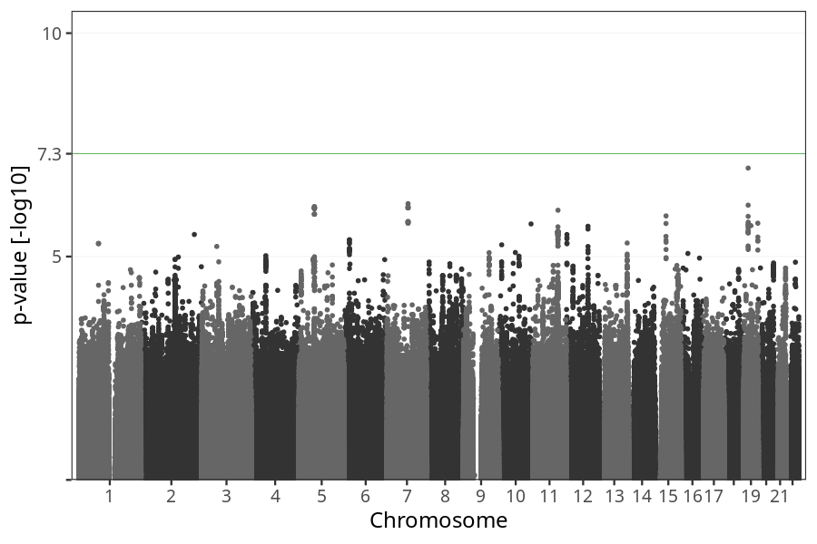

# Hyperemesis gravidarum
GWAS of mothers hospitalized due to prolonged nausea and vomiting.

### children

#### Phenotypes
| Value | N |
| ----- | - |
| 0 | 72641 |
| 1 | 748 |
| Total | 73389 |

#### Association results

- [Association results](regenie/pop_children_pheno_hyperemesis_gravidarum/pop_children_pheno_hyperemesis_gravidarum.md)
- [Results prior to COJO](regenie_no_cojo/pop_children_pheno_hyperemesis_gravidarum/pop_children_pheno_hyperemesis_gravidarum.md)

### mothers

#### Phenotypes
| Value | N |
| ----- | - |
| 0 | 55648 |
| 1 | 577 |
| Total | 56225 |

#### Association results

- [Association results](regenie/pop_mothers_pheno_hyperemesis_gravidarum/pop_mothers_pheno_hyperemesis_gravidarum.md)
- [Results prior to COJO](regenie_no_cojo/pop_mothers_pheno_hyperemesis_gravidarum/pop_mothers_pheno_hyperemesis_gravidarum.md)

### fathers

#### Phenotypes
| Value | N |
| ----- | - |
| 0 | 38022 |
| 1 | 430 |
| Total | 38452 |

#### Association results

- [Association results](regenie/pop_fathers_pheno_hyperemesis_gravidarum/pop_fathers_pheno_hyperemesis_gravidarum.md)
- [Results prior to COJO](regenie_no_cojo/pop_fathers_pheno_hyperemesis_gravidarum/pop_fathers_pheno_hyperemesis_gravidarum.md)

### children_no_nausea_vomiting

#### Phenotypes
| Value | N |
| ----- | - |
| 0 | 18590 |
| 1 | 748 |
| Total | 19338 |

#### Association results

- [Association results](regenie/pop_children_no_nausea_vomiting_pheno_hyperemesis_gravidarum/pop_children_no_nausea_vomiting_pheno_hyperemesis_gravidarum.md)
- [Results prior to COJO](regenie_no_cojo/pop_children_no_nausea_vomiting_pheno_hyperemesis_gravidarum/pop_children_no_nausea_vomiting_pheno_hyperemesis_gravidarum.md)

### mothers_no_nausea_vomiting

#### Phenotypes
| Value | N |
| ----- | - |
| 0 | 14361 |
| 1 | 577 |
| Total | 14938 |

#### Association results

- [Association results](regenie/pop_mothers_no_nausea_vomiting_pheno_hyperemesis_gravidarum/pop_mothers_no_nausea_vomiting_pheno_hyperemesis_gravidarum.md)
- [Results prior to COJO](regenie_no_cojo/pop_mothers_no_nausea_vomiting_pheno_hyperemesis_gravidarum/pop_mothers_no_nausea_vomiting_pheno_hyperemesis_gravidarum.md)

### fathers_no_nausea_vomiting

#### Phenotypes
| Value | N |
| ----- | - |
| 0 | 9461 |
| 1 | 430 |
| Total | 9891 |

#### Association results

- [Association results](regenie/pop_fathers_no_nausea_vomiting_pheno_hyperemesis_gravidarum/pop_fathers_no_nausea_vomiting_pheno_hyperemesis_gravidarum.md)
- [Results prior to COJO](regenie_no_cojo/pop_fathers_no_nausea_vomiting_pheno_hyperemesis_gravidarum/pop_fathers_no_nausea_vomiting_pheno_hyperemesis_gravidarum.md)

