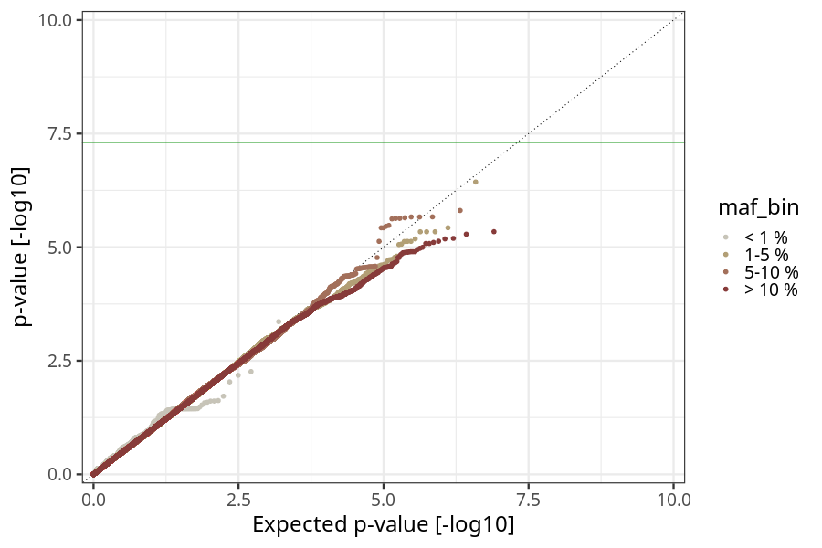
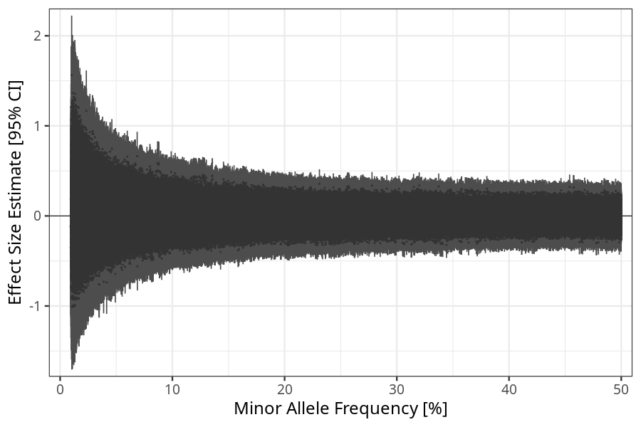
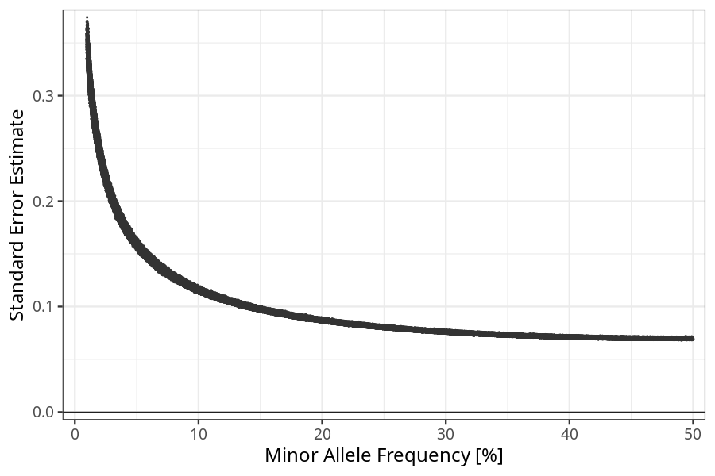

## hyperemesis_gravidarum in fathers
Association results by regenie for hyperemesis_gravidarum in fathers.
### Manhattan

### QQ plot

### Beta vs. Allele Frequency

### Standard error vs. Allele Frequency

