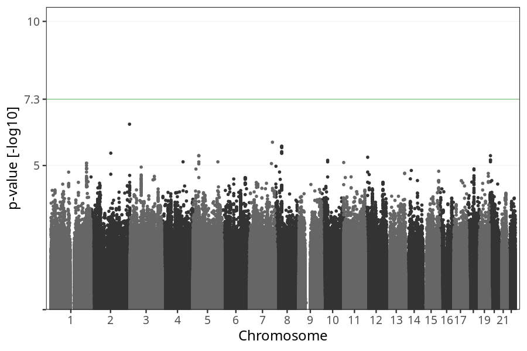

# Hyperemesis gravidarum
GWAS of participants of pregnancies where the mother was hospitalized due to prolonged nausea and vomiting.

### children

#### Phenotypes
| Value | N |
| ----- | - |
| 0 | 72641 |
| 1 | 748 |
| Total | 73389 |

#### Association results

- [Association results](regenie/hyperemesis_gravidarum_vs_all/pop_children_pheno_hg_vs_all.md)
- [Results prior to COJO](regenie_no_cojo/hyperemesis_gravidarum_vs_all/pop_children_pheno_hg_vs_all.md)

### mothers

#### Phenotypes
| Value | N |
| ----- | - |
| 0 | 55648 |
| 1 | 577 |
| Total | 56225 |

#### Association results

- [Association results](regenie/hyperemesis_gravidarum_vs_all/pop_mothers_pheno_hg_vs_all.md)
- [Results prior to COJO](regenie_no_cojo/hyperemesis_gravidarum_vs_all/pop_mothers_pheno_hg_vs_all.md)

### fathers

#### Phenotypes
| Value | N |
| ----- | - |
| 0 | 38022 |
| 1 | 430 |
| Total | 38452 |

#### Association results

- [Association results](regenie/hyperemesis_gravidarum_vs_all/pop_fathers_pheno_hg_vs_all.md)
- [Results prior to COJO](regenie_no_cojo/hyperemesis_gravidarum_vs_all/pop_fathers_pheno_hg_vs_all.md)

