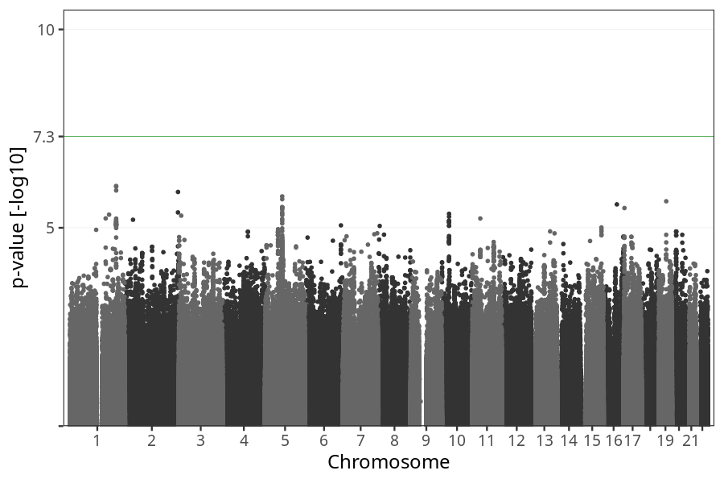

# Hyperemesis gravidarum vs. no nausea vomiting
GWAS of participants of pregnancies where the mother was hospitalized due to prolonged nausea and vomiting.

### children

#### Phenotypes
| Value | N |
| ----- | - |
| 0 | 18590 |
| 1 | 748 |
| Total | 19338 |

#### Association results

- [Association results](regenie/hyperemesis_gravidarum_vs_no_nausea_vomiting/pop_children_pheno_hg_vs_no_nausea_vomiting.md)
- [Results prior to COJO](regenie_no_cojo/hyperemesis_gravidarum_vs_no_nausea_vomiting/pop_children_pheno_hg_vs_no_nausea_vomiting.md)

### mothers

#### Phenotypes
| Value | N |
| ----- | - |
| 0 | 14361 |
| 1 | 577 |
| Total | 14938 |

#### Association results

- [Association results](regenie/hyperemesis_gravidarum_vs_no_nausea_vomiting/pop_mothers_pheno_hg_vs_no_nausea_vomiting.md)
- [Results prior to COJO](regenie_no_cojo/hyperemesis_gravidarum_vs_no_nausea_vomiting/pop_mothers_pheno_hg_vs_no_nausea_vomiting.md)

### fathers

#### Phenotypes
| Value | N |
| ----- | - |
| 0 | 9461 |
| 1 | 430 |
| Total | 9891 |

#### Association results

- [Association results](regenie/hyperemesis_gravidarum_vs_no_nausea_vomiting/pop_fathers_pheno_hg_vs_no_nausea_vomiting.md)
- [Results prior to COJO](regenie_no_cojo/hyperemesis_gravidarum_vs_no_nausea_vomiting/pop_fathers_pheno_hg_vs_no_nausea_vomiting.md)

