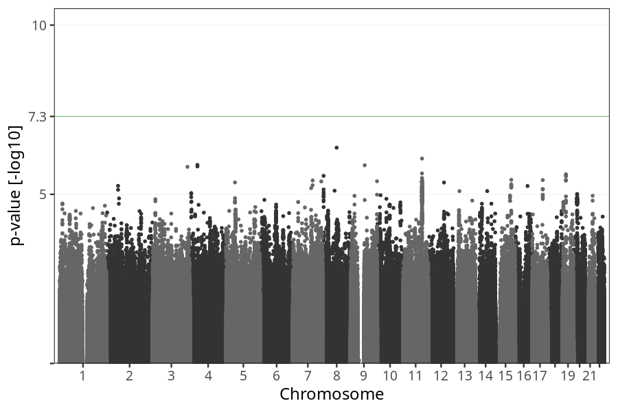
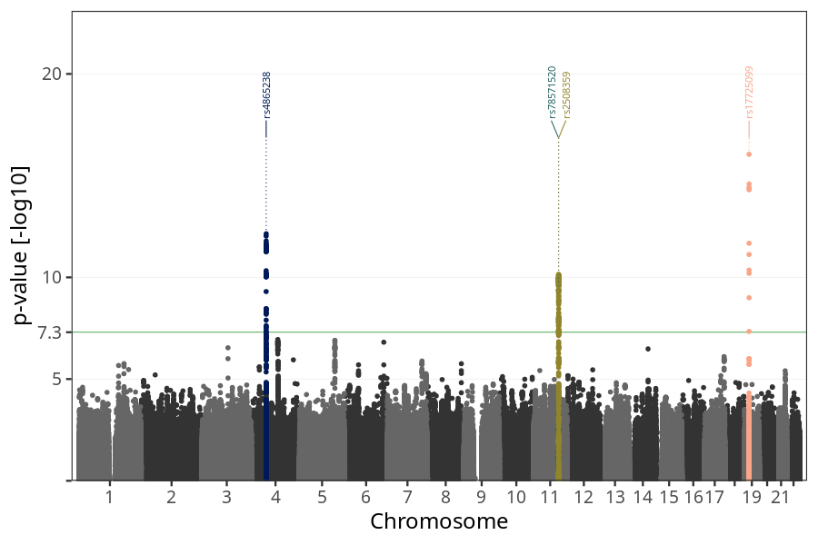
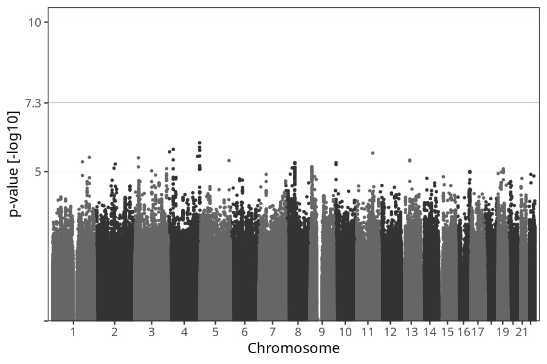

# Nausea vomiting week 13 to 16
GWAS of participants of pregnancies where the mother reported nausea vomiting stratified by week.

### children

#### Phenotypes
| Value | N |
| ----- | - |
| 0 | 66897 |
| 1 | 6492 |
| Total | 73389 |

#### Association results

- [Association results](regenie/long_term_nausea_vomiting_13w_16w/pop_children_pheno_long_term_nausea_vomiting_13w_16w.md)
- [Results prior to COJO](regenie_no_cojo/long_term_nausea_vomiting_13w_16w/pop_children_pheno_long_term_nausea_vomiting_13w_16w.md)

### mothers

#### Phenotypes
| Value | N |
| ----- | - |
| 0 | 51280 |
| 1 | 4945 |
| Total | 56225 |

#### Association results

- [Association results](regenie/long_term_nausea_vomiting_13w_16w/pop_mothers_pheno_long_term_nausea_vomiting_13w_16w.md)
- [Results prior to COJO](regenie_no_cojo/long_term_nausea_vomiting_13w_16w/pop_mothers_pheno_long_term_nausea_vomiting_13w_16w.md)

### fathers

#### Phenotypes
| Value | N |
| ----- | - |
| 0 | 34966 |
| 1 | 3486 |
| Total | 38452 |

#### Association results

- [Association results](regenie/long_term_nausea_vomiting_13w_16w/pop_fathers_pheno_long_term_nausea_vomiting_13w_16w.md)
- [Results prior to COJO](regenie_no_cojo/long_term_nausea_vomiting_13w_16w/pop_fathers_pheno_long_term_nausea_vomiting_13w_16w.md)

