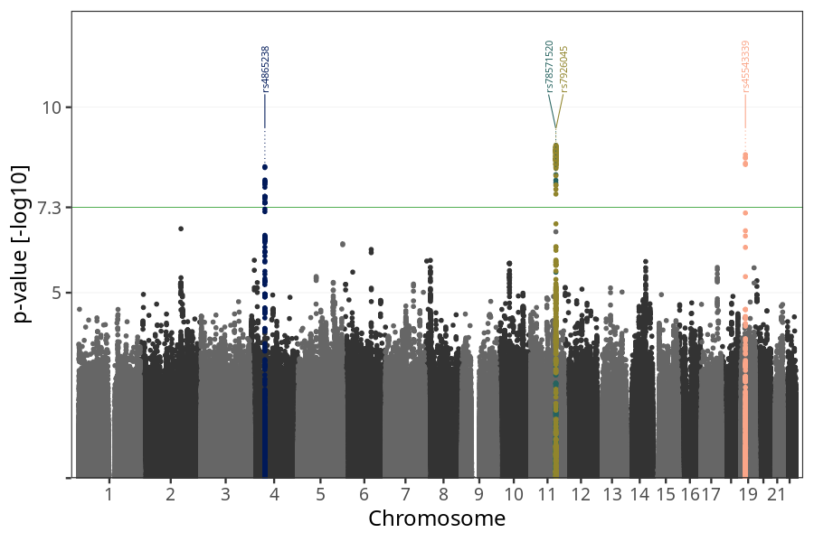

# Nausea vomiting week 17 to 20
GWAS of participants of pregnancies where the mother reported nausea vomiting stratified by week.

### children

#### Phenotypes
| Value | N |
| ----- | - |
| 0 | 69667 |
| 1 | 3722 |
| Total | 73389 |

#### Association results

- [Association results](regenie/long_term_nausea_vomiting_17w_20w/pop_children_pheno_long_term_nausea_vomiting_17w_20w.md)
- [Results prior to COJO](regenie_no_cojo/long_term_nausea_vomiting_17w_20w/pop_children_pheno_long_term_nausea_vomiting_17w_20w.md)

### mothers

#### Phenotypes
| Value | N |
| ----- | - |
| 0 | 53409 |
| 1 | 2816 |
| Total | 56225 |

#### Association results

- [Association results](regenie/long_term_nausea_vomiting_17w_20w/pop_mothers_pheno_long_term_nausea_vomiting_17w_20w.md)
- [Results prior to COJO](regenie_no_cojo/long_term_nausea_vomiting_17w_20w/pop_mothers_pheno_long_term_nausea_vomiting_17w_20w.md)

### fathers

#### Phenotypes
| Value | N |
| ----- | - |
| 0 | 36434 |
| 1 | 2018 |
| Total | 38452 |

#### Association results

- [Association results](regenie/long_term_nausea_vomiting_17w_20w/pop_fathers_pheno_long_term_nausea_vomiting_17w_20w.md)
- [Results prior to COJO](regenie_no_cojo/long_term_nausea_vomiting_17w_20w/pop_fathers_pheno_long_term_nausea_vomiting_17w_20w.md)

