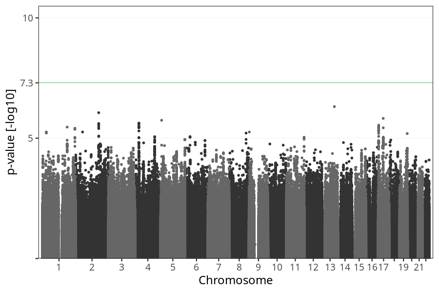
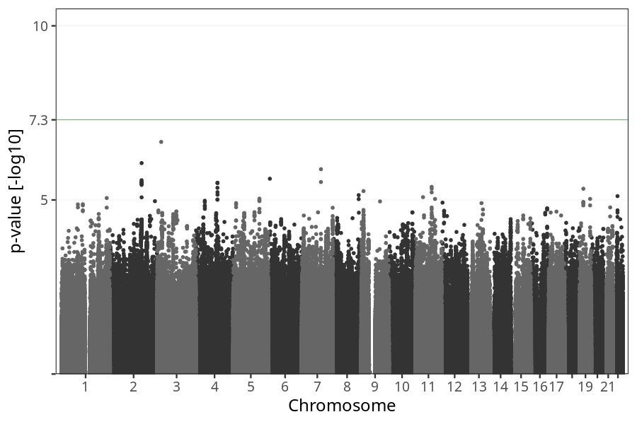
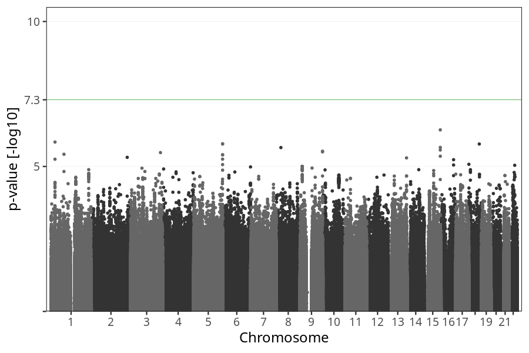

# Nausea vomiting week 25 to 29
GWAS of participants of pregnancies where the mother reported nausea vomiting stratified by week.

### children

#### Phenotypes
| Value | N |
| ----- | - |
| 0 | 72088 |
| 1 | 1301 |
| Total | 73389 |

#### Association results

- [Association results](regenie/long_term_nausea_vomiting_25w_28w/pop_children_pheno_long_term_nausea_vomiting_25w_28w.md)
- [Results prior to COJO](regenie_no_cojo/long_term_nausea_vomiting_25w_28w/pop_children_pheno_long_term_nausea_vomiting_25w_28w.md)

### mothers

#### Phenotypes
| Value | N |
| ----- | - |
| 0 | 55226 |
| 1 | 999 |
| Total | 56225 |

#### Association results

- [Association results](regenie/long_term_nausea_vomiting_25w_28w/pop_mothers_pheno_long_term_nausea_vomiting_25w_28w.md)
- [Results prior to COJO](regenie_no_cojo/long_term_nausea_vomiting_25w_28w/pop_mothers_pheno_long_term_nausea_vomiting_25w_28w.md)

### fathers

#### Phenotypes
| Value | N |
| ----- | - |
| 0 | 37750 |
| 1 | 702 |
| Total | 38452 |

#### Association results

- [Association results](regenie/long_term_nausea_vomiting_25w_28w/pop_fathers_pheno_long_term_nausea_vomiting_25w_28w.md)
- [Results prior to COJO](regenie_no_cojo/long_term_nausea_vomiting_25w_28w/pop_fathers_pheno_long_term_nausea_vomiting_25w_28w.md)

