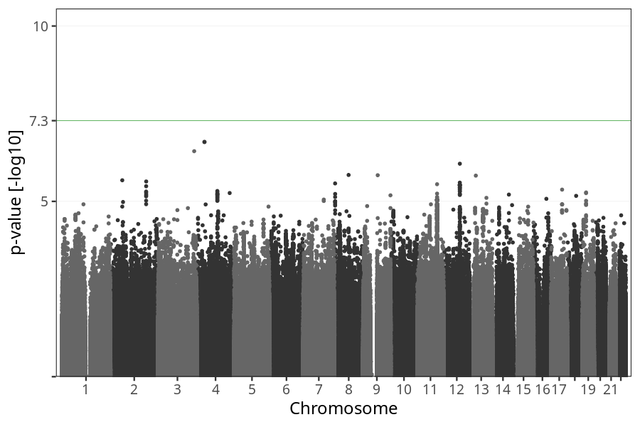
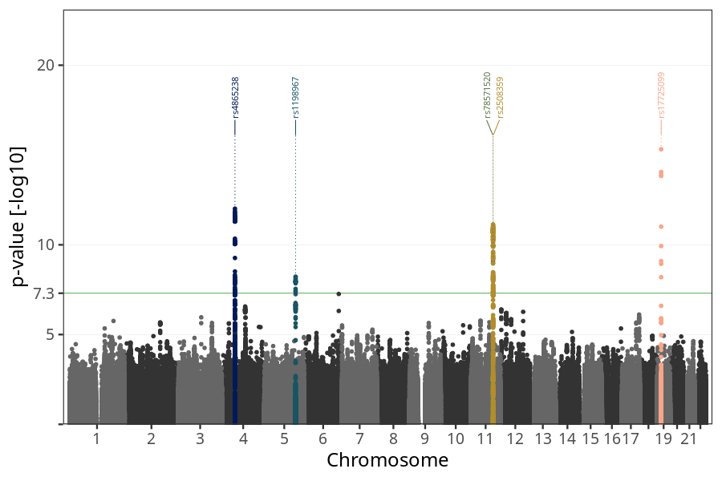
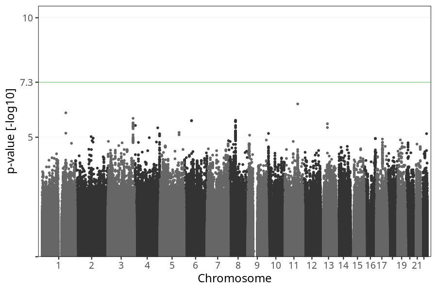

# Long-term nausea vomiting after week 12
GWAS of participants of pregnancies where the mother reported suffering from long-term nausea vomiting after week 13.

### children

#### Phenotypes
| Value | N |
| ----- | - |
| 0 | 66263 |
| 1 | 7126 |
| Total | 73389 |

#### Association results

- [Association results](regenie/long_term_nausea_vomiting_after_13w/pop_children_pheno_long_term_nausea_vomiting_after_13w.md)
- [Results prior to COJO](regenie_no_cojo/long_term_nausea_vomiting_after_13w/pop_children_pheno_long_term_nausea_vomiting_after_13w.md)

### mothers

#### Phenotypes
| Value | N |
| ----- | - |
| 0 | 50797 |
| 1 | 5428 |
| Total | 56225 |

#### Association results

- [Association results](regenie/long_term_nausea_vomiting_after_13w/pop_mothers_pheno_long_term_nausea_vomiting_after_13w.md)
- [Results prior to COJO](regenie_no_cojo/long_term_nausea_vomiting_after_13w/pop_mothers_pheno_long_term_nausea_vomiting_after_13w.md)

### fathers

#### Phenotypes
| Value | N |
| ----- | - |
| 0 | 34657 |
| 1 | 3795 |
| Total | 38452 |

#### Association results

- [Association results](regenie/long_term_nausea_vomiting_after_13w/pop_fathers_pheno_long_term_nausea_vomiting_after_13w.md)
- [Results prior to COJO](regenie_no_cojo/long_term_nausea_vomiting_after_13w/pop_fathers_pheno_long_term_nausea_vomiting_after_13w.md)

