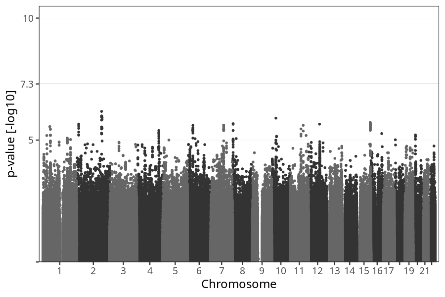
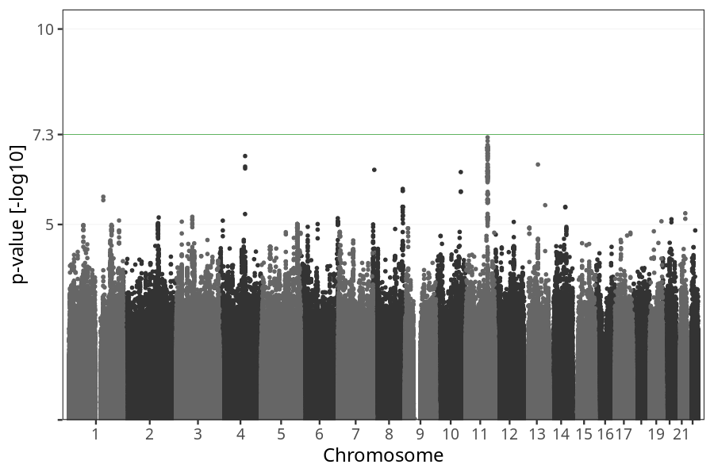
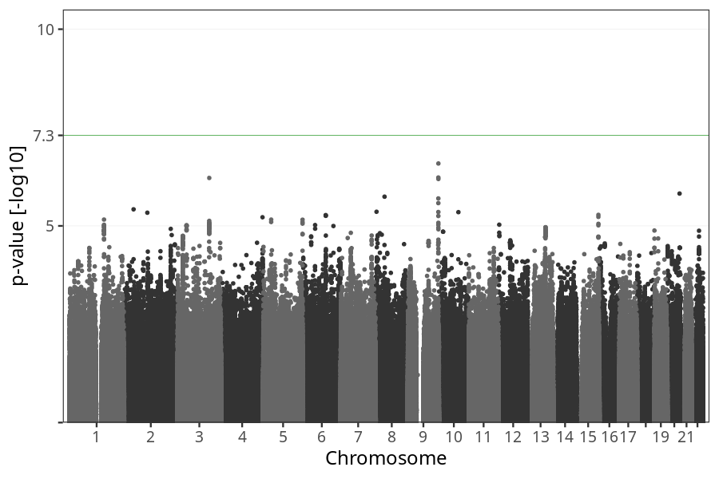

# Long-term nausea vomiting after week 21
GWAS of participants of pregnancies where the mother reported suffering from long-term nausea vomiting after week 21.

### children

#### Phenotypes
| Value | N |
| ----- | - |
| 0 | 71037 |
| 1 | 2352 |
| Total | 73389 |

#### Association results

- [Association results](regenie/long_term_nausea_vomiting_after_21w/pop_children_pheno_long_term_nausea_vomiting_after_21w.md)
- [Results prior to COJO](regenie_no_cojo/long_term_nausea_vomiting_after_21w/pop_children_pheno_long_term_nausea_vomiting_after_21w.md)

### mothers

#### Phenotypes
| Value | N |
| ----- | - |
| 0 | 54439 |
| 1 | 1786 |
| Total | 56225 |

#### Association results

- [Association results](regenie/long_term_nausea_vomiting_after_21w/pop_mothers_pheno_long_term_nausea_vomiting_after_21w.md)
- [Results prior to COJO](regenie_no_cojo/long_term_nausea_vomiting_after_21w/pop_mothers_pheno_long_term_nausea_vomiting_after_21w.md)

### fathers

#### Phenotypes
| Value | N |
| ----- | - |
| 0 | 37210 |
| 1 | 1242 |
| Total | 38452 |

#### Association results

- [Association results](regenie/long_term_nausea_vomiting_after_21w/pop_fathers_pheno_long_term_nausea_vomiting_after_21w.md)
- [Results prior to COJO](regenie_no_cojo/long_term_nausea_vomiting_after_21w/pop_fathers_pheno_long_term_nausea_vomiting_after_21w.md)

