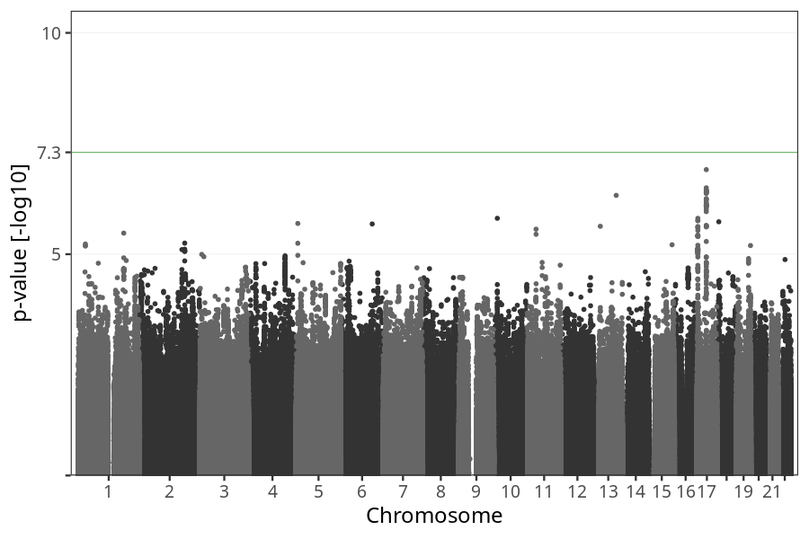
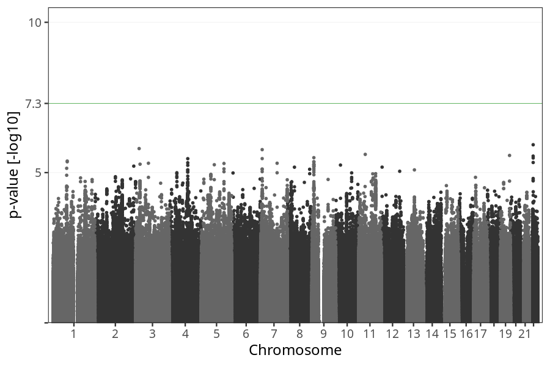
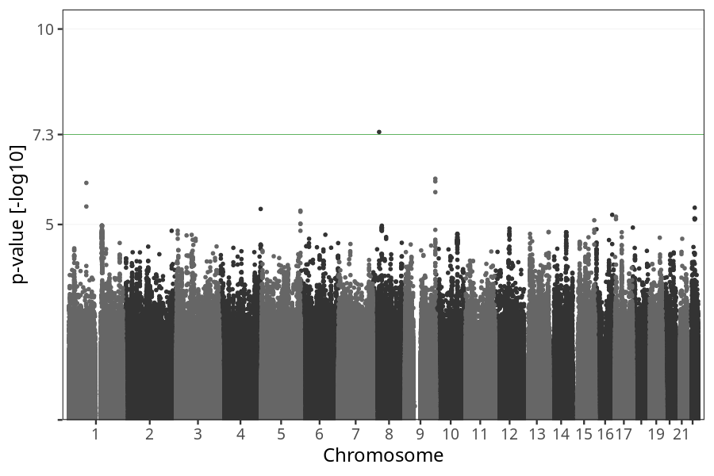

# Long-term nausea vomiting after week 25
GWAS of participants of pregnancies where the mother reported suffering from long-term nausea vomiting after week 25.

### children

#### Phenotypes
| Value | N |
| ----- | - |
| 0 | 71900 |
| 1 | 1489 |
| Total | 73389 |

#### Association results

- [Association results](regenie/long_term_nausea_vomiting_after_25w/pop_children_pheno_long_term_nausea_vomiting_after_25w.md)
- [Results prior to COJO](regenie_no_cojo/long_term_nausea_vomiting_after_25w/pop_children_pheno_long_term_nausea_vomiting_after_25w.md)

### mothers

#### Phenotypes
| Value | N |
| ----- | - |
| 0 | 55094 |
| 1 | 1131 |
| Total | 56225 |

#### Association results

- [Association results](regenie/long_term_nausea_vomiting_after_25w/pop_mothers_pheno_long_term_nausea_vomiting_after_25w.md)
- [Results prior to COJO](regenie_no_cojo/long_term_nausea_vomiting_after_25w/pop_mothers_pheno_long_term_nausea_vomiting_after_25w.md)

### fathers

#### Phenotypes
| Value | N |
| ----- | - |
| 0 | 37664 |
| 1 | 788 |
| Total | 38452 |

#### Association results

- [Association results](regenie/long_term_nausea_vomiting_after_25w/pop_fathers_pheno_long_term_nausea_vomiting_after_25w.md)
- [Results prior to COJO](regenie_no_cojo/long_term_nausea_vomiting_after_25w/pop_fathers_pheno_long_term_nausea_vomiting_after_25w.md)

