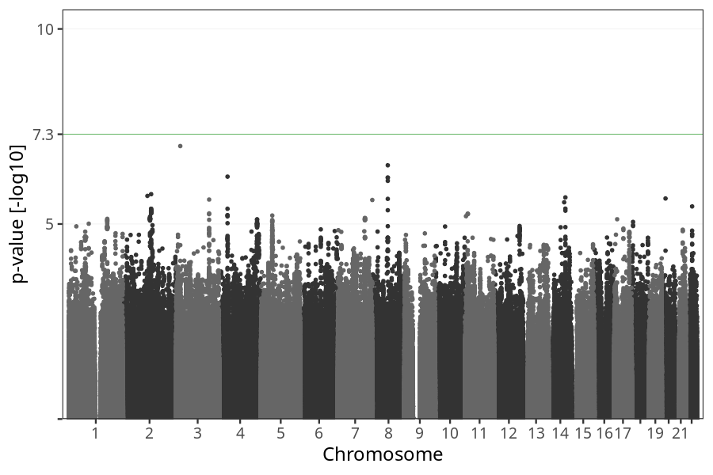
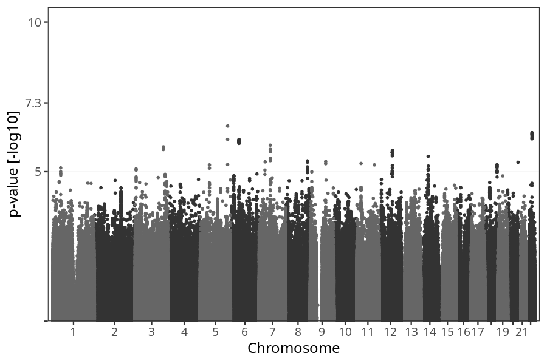
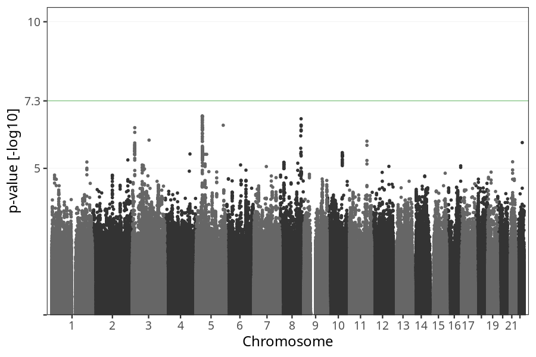

# Nausea before week 4
GWAS of participants of pregnancies where the mother reported nausea before week 4.

### children

#### Phenotypes
| Value | N |
| ----- | - |
| 0 | 58934 |
| 1 | 14455 |
| Total | 73389 |

#### Association results

- [Association results](regenie/nausea_before_4w/pop_children_pheno_nausea_before_4w.md)
- [Results prior to COJO](regenie_no_cojo/nausea_before_4w/pop_children_pheno_nausea_before_4w.md)

### mothers

#### Phenotypes
| Value | N |
| ----- | - |
| 0 | 45154 |
| 1 | 11071 |
| Total | 56225 |

#### Association results

- [Association results](regenie/nausea_before_4w/pop_mothers_pheno_nausea_before_4w.md)
- [Results prior to COJO](regenie_no_cojo/nausea_before_4w/pop_mothers_pheno_nausea_before_4w.md)

### fathers

#### Phenotypes
| Value | N |
| ----- | - |
| 0 | 30895 |
| 1 | 7557 |
| Total | 38452 |

#### Association results

- [Association results](regenie/nausea_before_4w/pop_fathers_pheno_nausea_before_4w.md)
- [Results prior to COJO](regenie_no_cojo/nausea_before_4w/pop_fathers_pheno_nausea_before_4w.md)

