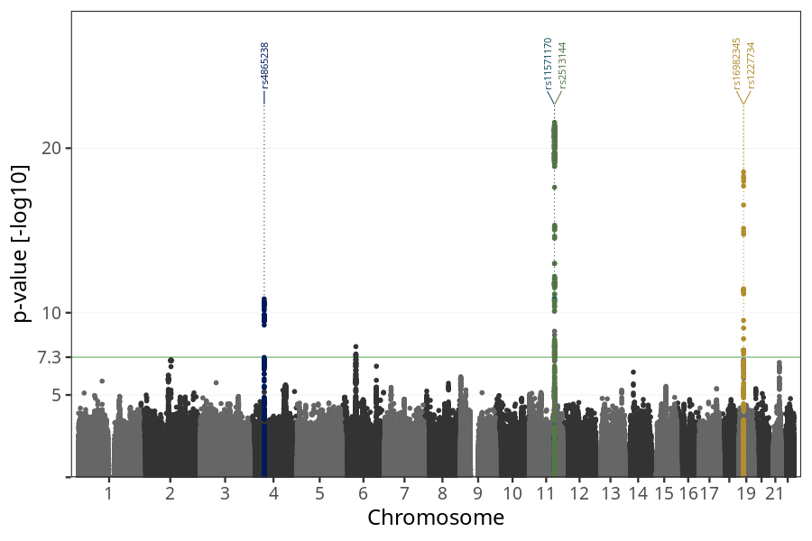

# Nausea vomiting week 13 to 15
GWAS of participants of pregnancies where the mother reported nausea vomiting stratified by week.

### children

#### Phenotypes
| Value | N |
| ----- | - |
| 0 | 54031 |
| 1 | 19358 |
| Total | 73389 |

#### Association results

- [Association results](regenie/nausea_vomiting_13w_15w/pop_children_pheno_nausea_vomiting_13w_15w.md)
- [Results prior to COJO](regenie_no_cojo/nausea_vomiting_13w_15w/pop_children_pheno_nausea_vomiting_13w_15w.md)

### mothers

#### Phenotypes
| Value | N |
| ----- | - |
| 0 | 41592 |
| 1 | 14633 |
| Total | 56225 |

#### Association results

- [Association results](regenie/nausea_vomiting_13w_15w/pop_mothers_pheno_nausea_vomiting_13w_15w.md)
- [Results prior to COJO](regenie_no_cojo/nausea_vomiting_13w_15w/pop_mothers_pheno_nausea_vomiting_13w_15w.md)

### fathers

#### Phenotypes
| Value | N |
| ----- | - |
| 0 | 28175 |
| 1 | 10277 |
| Total | 38452 |

#### Association results

- [Association results](regenie/nausea_vomiting_13w_15w/pop_fathers_pheno_nausea_vomiting_13w_15w.md)
- [Results prior to COJO](regenie_no_cojo/nausea_vomiting_13w_15w/pop_fathers_pheno_nausea_vomiting_13w_15w.md)

