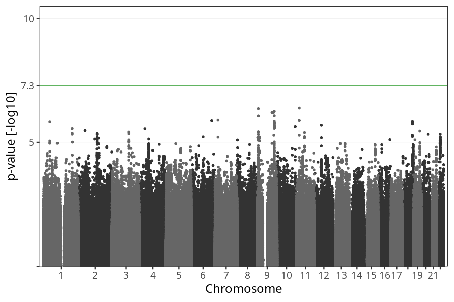
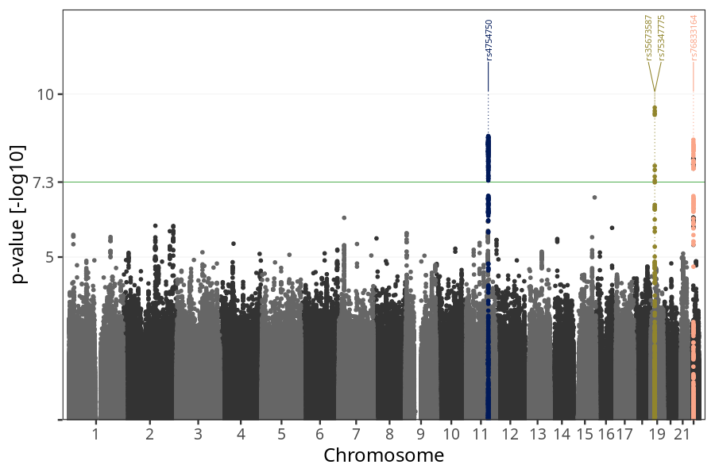
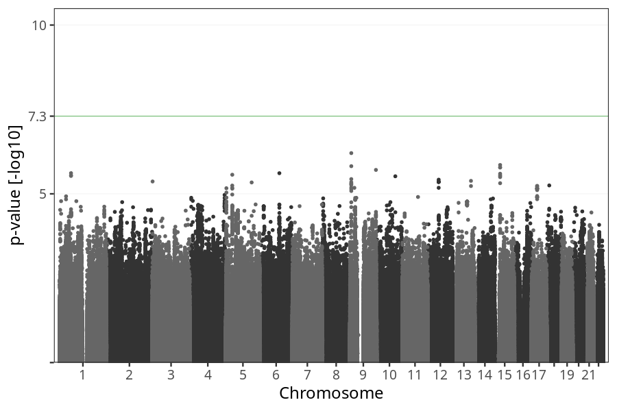

# Nausea vomiting week 5 to 8
GWAS of participants of pregnancies where the mother reported nausea vomiting stratified by week.

### children

#### Phenotypes
| Value | N |
| ----- | - |
| 0 | 32199 |
| 1 | 41190 |
| Total | 73389 |

#### Association results

- [Association results](regenie/nausea_vomiting_5w_8w/pop_children_pheno_nausea_vomiting_5w_8w.md)
- [Results prior to COJO](regenie_no_cojo/nausea_vomiting_5w_8w/pop_children_pheno_nausea_vomiting_5w_8w.md)

### mothers

#### Phenotypes
| Value | N |
| ----- | - |
| 0 | 24899 |
| 1 | 31326 |
| Total | 56225 |

#### Association results

- [Association results](regenie/nausea_vomiting_5w_8w/pop_mothers_pheno_nausea_vomiting_5w_8w.md)
- [Results prior to COJO](regenie_no_cojo/nausea_vomiting_5w_8w/pop_mothers_pheno_nausea_vomiting_5w_8w.md)

### fathers

#### Phenotypes
| Value | N |
| ----- | - |
| 0 | 16593 |
| 1 | 21859 |
| Total | 38452 |

#### Association results

- [Association results](regenie/nausea_vomiting_5w_8w/pop_fathers_pheno_nausea_vomiting_5w_8w.md)
- [Results prior to COJO](regenie_no_cojo/nausea_vomiting_5w_8w/pop_fathers_pheno_nausea_vomiting_5w_8w.md)

