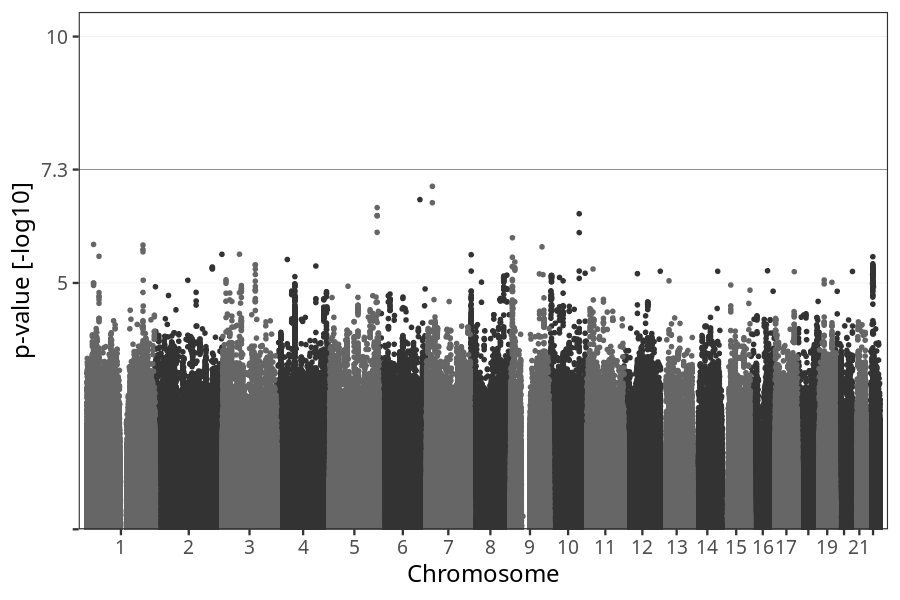
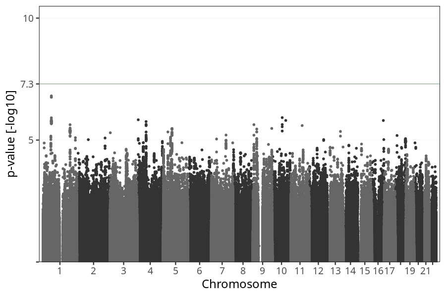

# Nausea vomiting before week 8
GWAS of participants of pregnancies where the mother reported nausea vomiting before week 8.

### children

#### Phenotypes
| Value | N |
| ----- | - |
| 0 | 29622 |
| 1 | 43767 |
| Total | 73389 |

#### Association results

- [Association results](regenie/nausea_vomiting_before_8w/pop_children_pheno_nausea_vomiting_before_8w.md)
- [Results prior to COJO](regenie_no_cojo/nausea_vomiting_before_8w/pop_children_pheno_nausea_vomiting_before_8w.md)

### mothers

#### Phenotypes
| Value | N |
| ----- | - |
| 0 | 22862 |
| 1 | 33363 |
| Total | 56225 |

#### Association results

- [Association results](regenie/nausea_vomiting_before_8w/pop_mothers_pheno_nausea_vomiting_before_8w.md)
- [Results prior to COJO](regenie_no_cojo/nausea_vomiting_before_8w/pop_mothers_pheno_nausea_vomiting_before_8w.md)

### fathers

#### Phenotypes
| Value | N |
| ----- | - |
| 0 | 15261 |
| 1 | 23191 |
| Total | 38452 |

#### Association results

- [Association results](regenie/nausea_vomiting_before_8w/pop_fathers_pheno_nausea_vomiting_before_8w.md)
- [Results prior to COJO](regenie_no_cojo/nausea_vomiting_before_8w/pop_fathers_pheno_nausea_vomiting_before_8w.md)

