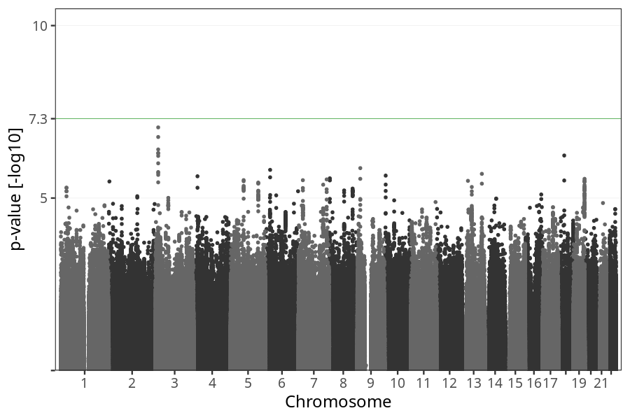
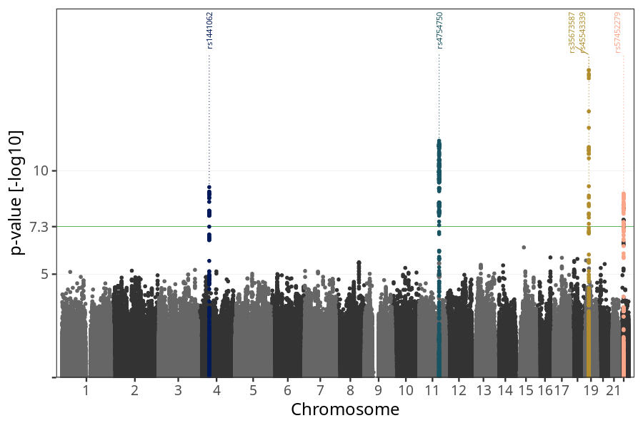
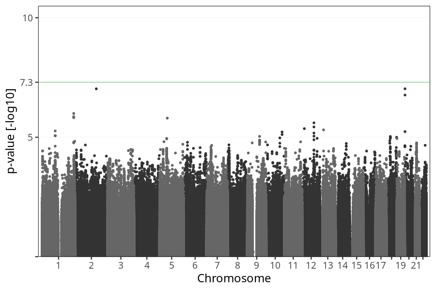

# Nausea vomiting during pregnancy
GWAS of participants of pregnancies where the mother suffered from nausea and vomiting.

### children

#### Phenotypes
| Value | N |
| ----- | - |
| 0 | 18590 |
| 1 | 54060 |
| 2 | 739 |
| Total | 73389 |

#### Association results

- [Association results](regenie/nausea_vomiting_strength/pop_children_pheno_nausea_vomiting_strength.md)
- [Results prior to COJO](regenie_no_cojo/nausea_vomiting_strength/pop_children_pheno_nausea_vomiting_strength.md)

### mothers

#### Phenotypes
| Value | N |
| ----- | - |
| 0 | 14361 |
| 1 | 41293 |
| 2 | 571 |
| Total | 56225 |

#### Association results

- [Association results](regenie/nausea_vomiting_strength/pop_mothers_pheno_nausea_vomiting_strength.md)
- [Results prior to COJO](regenie_no_cojo/nausea_vomiting_strength/pop_mothers_pheno_nausea_vomiting_strength.md)

### fathers

#### Phenotypes
| Value | N |
| ----- | - |
| 0 | 9461 |
| 1 | 28565 |
| 2 | 426 |
| Total | 38452 |

#### Association results

- [Association results](regenie/nausea_vomiting_strength/pop_fathers_pheno_nausea_vomiting_strength.md)
- [Results prior to COJO](regenie_no_cojo/nausea_vomiting_strength/pop_fathers_pheno_nausea_vomiting_strength.md)

