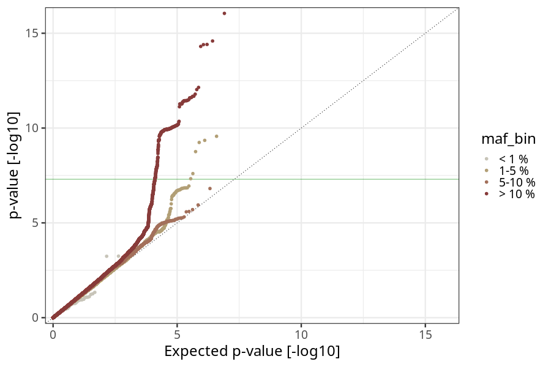
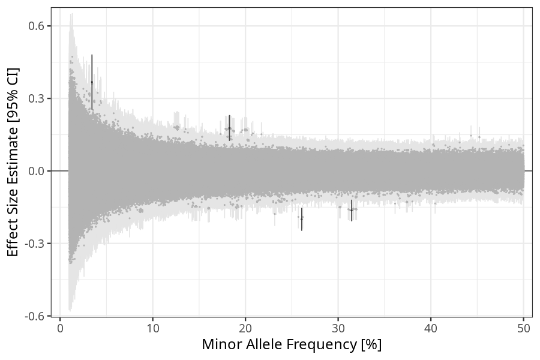
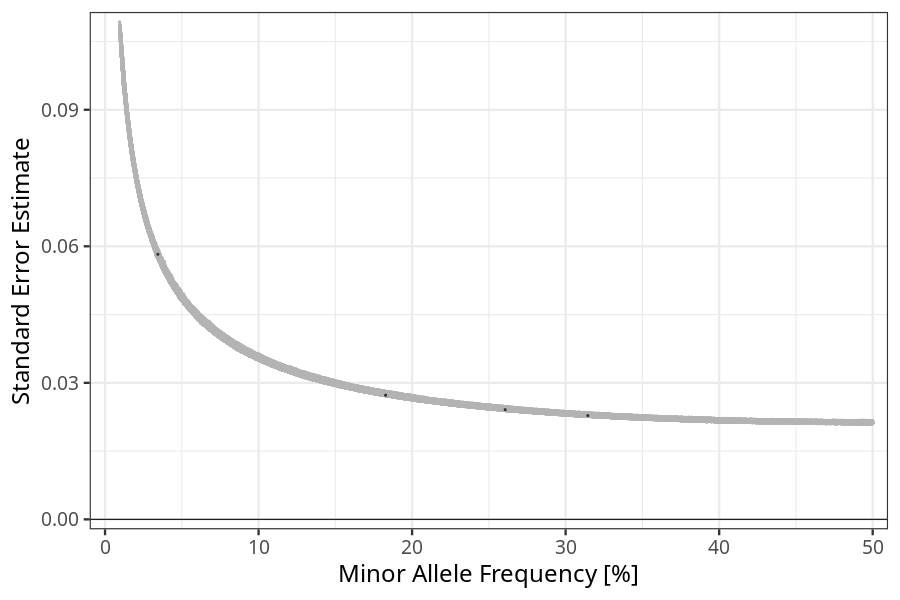

## long_term_nausea_vomiting_13w_16w in mothers
Association results by regenie for long_term_nausea_vomiting_13w_16w in mothers, followed by COJO analysis of the hits passing p < 5e-8.
### Manhattan

### Top hits
| SNP | chr | bp | ref | ref freq | beta | se | p | n | Ensembl | Phenoscanner | freq geno | b joint | b joint se | p joint | ld r |
| --- | --- | -- | --- | -------- | ---- | -- | - | - | ------- | ------------ | --------- | ------- | ---------- | ------- | ---- |
| rs4865238 | 4 | 58363165 | A | 0.314476 | -0.163626 | 0.0228019 | 7.17906e-13 | 56212.3 | [RP11-319E12.2](ensembl/rs4865238.md) | No Results | 0.31387 | -0.163626 | 0.0228121 | 7.35006e-13 | 0 |
| rs78571520 | 11 | 100982016 | G | 0.0344016 | 0.367728 | 0.0582386 | 2.71628e-10 | 55914.6 | [PGR](ensembl/rs78571520.md) | No Results | 0.0344672 | 0.391507 | 0.0583607 | 1.96782e-11 | -0.0594971 |
| rs2508359 | 11 | 101257152 | A | 0.182716 | 0.177669 | 0.027269 | 7.24863e-11 | 56730.7 | [TRPC6](ensembl/rs2508359.md) | No Results | 0.183211 | 0.188497 | 0.0273267 | 5.27703e-12 | 0 |
| rs17725099 | 19 | 18482358 | A | 0.260649 | -0.200459 | 0.0241003 | 8.96887e-17 | 56366.9 | [PGPEP1](ensembl/rs17725099.md) | [Comparative body size at age 10](phenoscanner/rs17725099.md) | 0.259783 | -0.200459 | 0.0241149 | 9.35716e-17 | 0 |
### Quality Control
- QQ plot

- Beta vs. Allele Frequency

- Standard error vs. Allele Frequency

