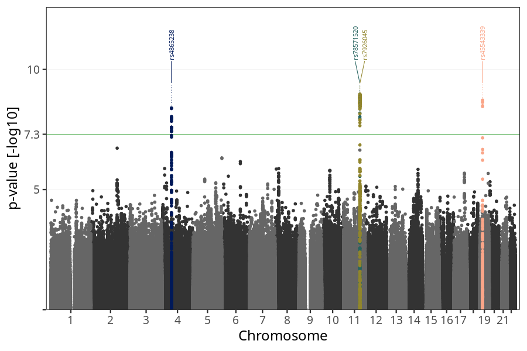
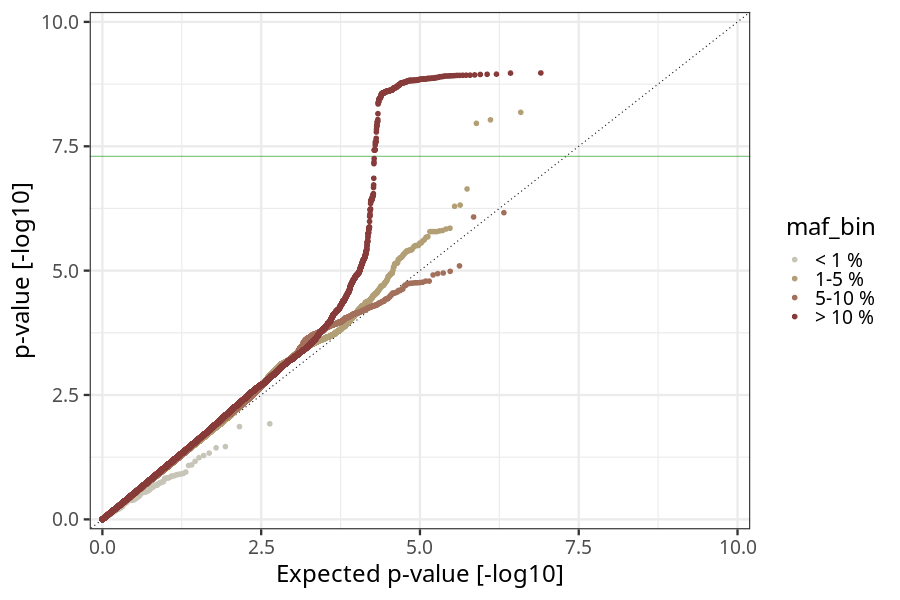
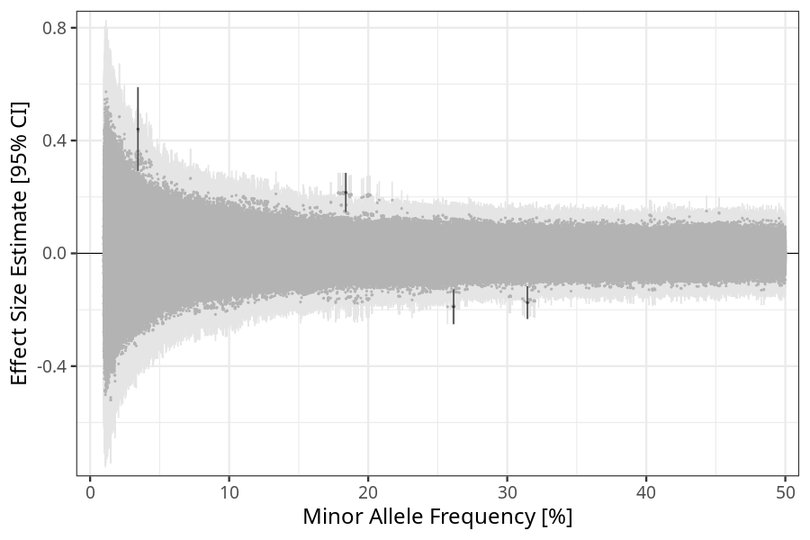
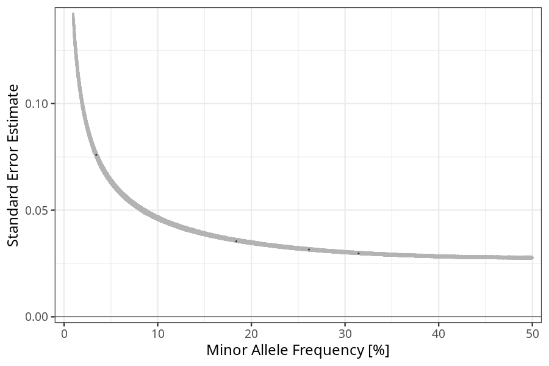

## long_term_nausea_vomiting_17w_20w in mothers
Association results by regenie for long_term_nausea_vomiting_17w_20w in mothers, followed by COJO analysis of the hits passing p < 5e-8.
### Manhattan

### Top hits
| SNP | chr | bp | ref | ref freq | beta | se | p | n | Ensembl | Phenoscanner | freq geno | b joint | b joint se | p joint | ld r |
| --- | --- | -- | --- | -------- | ---- | -- | - | - | ------- | ------------ | --------- | ------- | ---------- | ------- | ---- |
| rs4865238 | 4 | 58363165 | A | 0.314476 | -0.174709 | 0.0296946 | 4.01613e-09 | 56217.4 | [RP11-319E12.2](ensembl/rs4865238.md) | No Results | 0.31387 | -0.174709 | 0.0297035 | 4.05904e-09 | 0 |
| rs78571520 | 11 | 100982016 | G | 0.0344016 | 0.44062 | 0.0759508 | 6.57685e-09 | 55759.2 | [PGR](ensembl/rs78571520.md) | No Results | 0.0344672 | 0.469741 | 0.0761069 | 6.73809e-10 | -0.0598419 |
| rs7926045 | 11 | 101239124 | G | 0.183871 | 0.215972 | 0.0354068 | 1.06246e-09 | 56792.2 | [TRPC6](ensembl/rs7926045.md) | No Results | 0.184247 | 0.228957 | 0.0354805 | 1.09631e-10 | 0 |
| rs45543339 | 19 | 18503194 | T | 0.261435 | -0.189495 | 0.0315503 | 1.90011e-09 | 55703.3 | [LRRC25](ensembl/rs45543339.md) | [[...]](phenoscanner/rs45543339.md) | 0.259952 | -0.189495 | 0.0315602 | 1.92238e-09 | 0 |
### Quality Control
- QQ plot

- Beta vs. Allele Frequency

- Standard error vs. Allele Frequency

