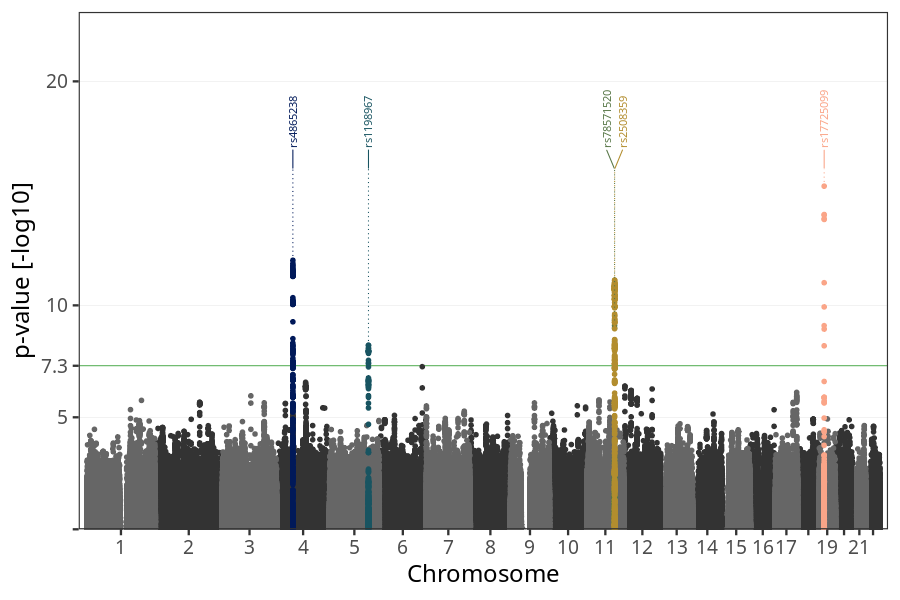

## long_term_nausea_vomiting_after_13w in mothers
Association results by regenie for long_term_nausea_vomiting_after_13w in mothers, followed by COJO analysis of the hits passing p < 5e-8.
### Manhattan

### Top hits
| SNP | chr | bp | ref | ref freq | beta | se | p | n | Ensembl | Phenoscanner | freq geno | b joint | b joint se | p joint | ld r |
| --- | --- | -- | --- | -------- | ---- | -- | - | - | ------- | ------------ | --------- | ------- | ---------- | ------- | ---- |
| rs4865238 | 4 | 58363165 | A | 0.314476 | -0.155973 | 0.0218628 | 9.73707e-13 | 56239.7 | [RP11-319E12.2](ensembl/rs4865238.md) | No Results | 0.31387 | -0.155973 | 0.0218725 | 9.96347e-13 | 0 |
| rs1198967 | 5 | 141749707 | A | 0.232765 | -0.139766 | 0.0240349 | 6.05878e-09 | 56215 | [AC005592.2](ensembl/rs1198967.md) | No Results | 0.232843 | -0.139766 | 0.0240419 | 6.12053e-09 | 0 |
| rs78571520 | 11 | 100982016 | G | 0.0344016 | 0.347947 | 0.0558732 | 4.74118e-10 | 55869.3 | [PGR](ensembl/rs78571520.md) | No Results | 0.0344672 | 0.371842 | 0.0559898 | 3.11054e-11 | -0.0594971 |
| rs2508359 | 11 | 101257152 | A | 0.182716 | 0.179136 | 0.0261584 | 7.4824e-12 | 56692.5 | [TRPC6](ensembl/rs2508359.md) | No Results | 0.183211 | 0.189419 | 0.0262148 | 4.98676e-13 | 0 |
| rs17725099 | 19 | 18482358 | A | 0.260649 | -0.18756 | 0.0231073 | 4.78182e-16 | 56413.4 | [PGPEP1](ensembl/rs17725099.md) | [Comparative body size at age 10](phenoscanner/rs17725099.md) | 0.259783 | -0.18756 | 0.0231206 | 4.96903e-16 | 0 |
### Quality Control
- QQ plot

- Beta vs. Allele Frequency

- Standard error vs. Allele Frequency

