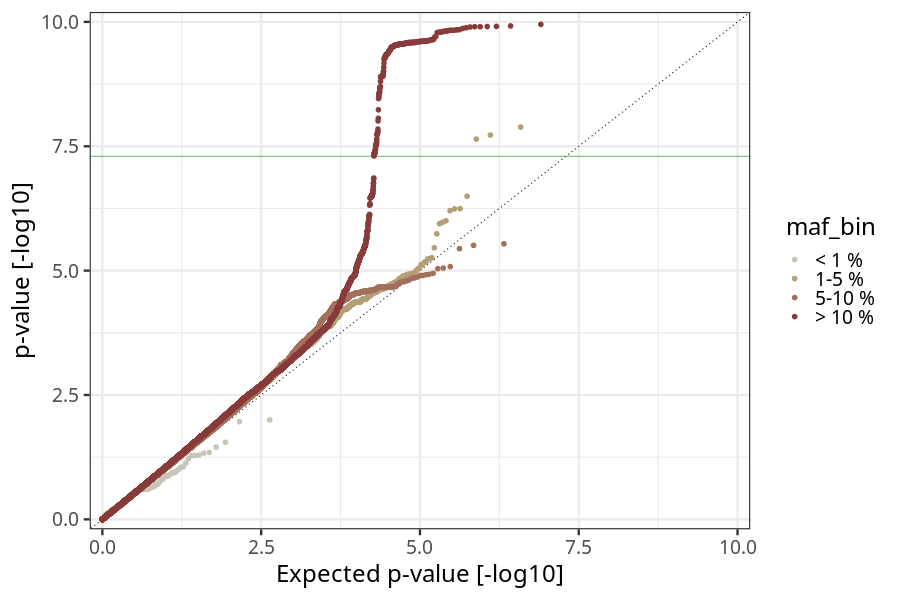

## long_term_nausea_vomiting_after_17w in mothers
Association results by regenie for long_term_nausea_vomiting_after_17w in mothers, followed by COJO analysis of the hits passing p < 5e-8.
### Manhattan

### Top hits
| SNP | chr | bp | ref | ref freq | beta | se | p | n | Ensembl | Phenoscanner | freq geno | b joint | b joint se | p joint | ld r |
| --- | --- | -- | --- | -------- | ---- | -- | - | - | ------- | ------------ | --------- | ------- | ---------- | ------- | ---- |
| rs4865238 | 4 | 58363165 | A | 0.314476 | -0.160628 | 0.027913 | 8.68499e-09 | 56130 | [RP11-319E12.2](ensembl/rs4865238.md) | No Results | 0.31387 | -0.160628 | 0.027921 | 8.76999e-09 | 0 |
| rs78571520 | 11 | 100982016 | G | 0.0344016 | 0.405525 | 0.0713215 | 1.30146e-08 | 55782.1 | [PGR](ensembl/rs78571520.md) | No Results | 0.0344672 | 0.434415 | 0.071468 | 1.21345e-09 | -0.0599773 |
| rs4350332 | 11 | 101232004 | G | 0.18387 | 0.214577 | 0.0332696 | 1.12115e-10 | 56738.7 | [TRPC6](ensembl/rs4350332.md) | No Results | 0.184086 | 0.226629 | 0.0333405 | 1.06518e-11 | 0 |
### Quality Control
- QQ plot

- Beta vs. Allele Frequency

- Standard error vs. Allele Frequency

