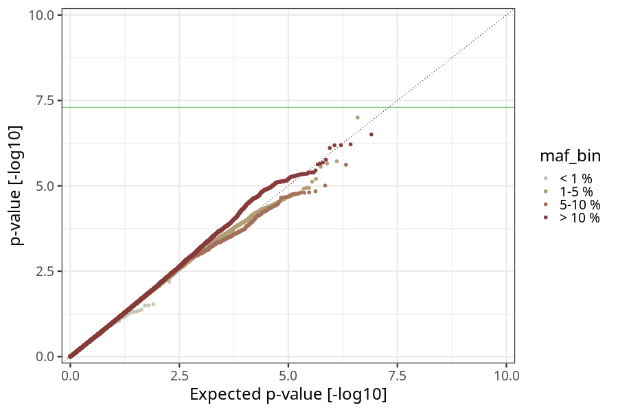
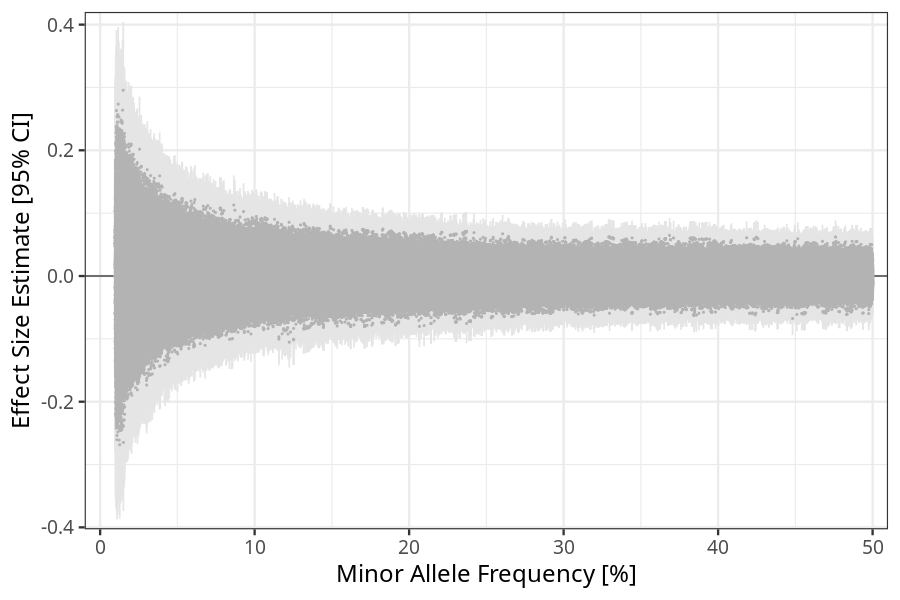
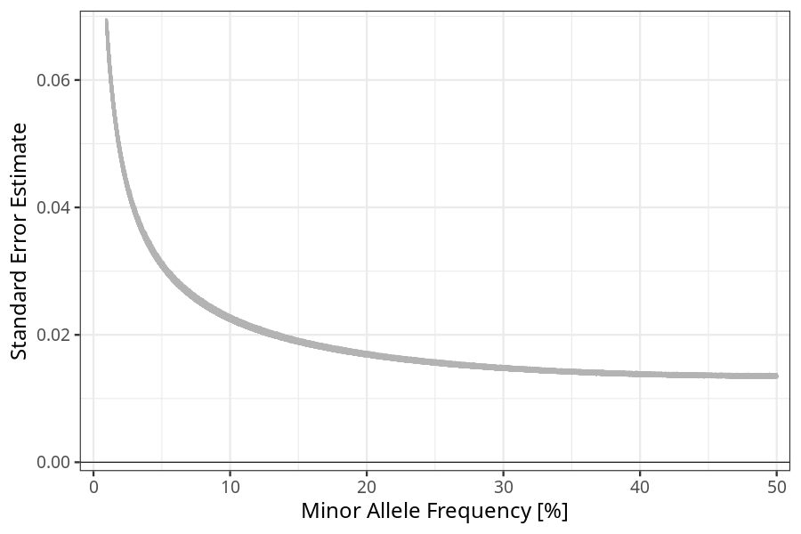

## nausea_before_4w in children
Association results by regenie for nausea_before_4w in children, followed by COJO analysis of the hits passing p < 5e-8.
### Manhattan

### Top hits
| SNP | chr | bp | ref | ref freq | beta | se | p | n | Ensembl | Phenoscanner | freq geno | b joint | b joint se | p joint | ld r |
| --- | --- | -- | --- | -------- | ---- | -- | - | - | ------- | ------------ | --------- | ------- | ---------- | ------- | ---- |
### Quality Control
- QQ plot

- Beta vs. Allele Frequency

- Standard error vs. Allele Frequency

