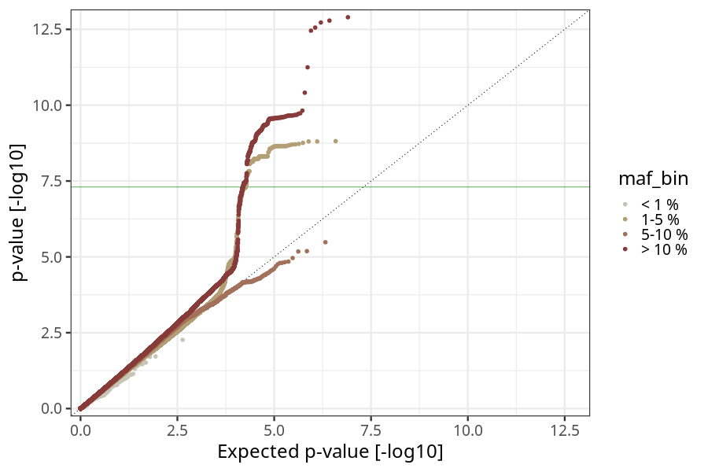
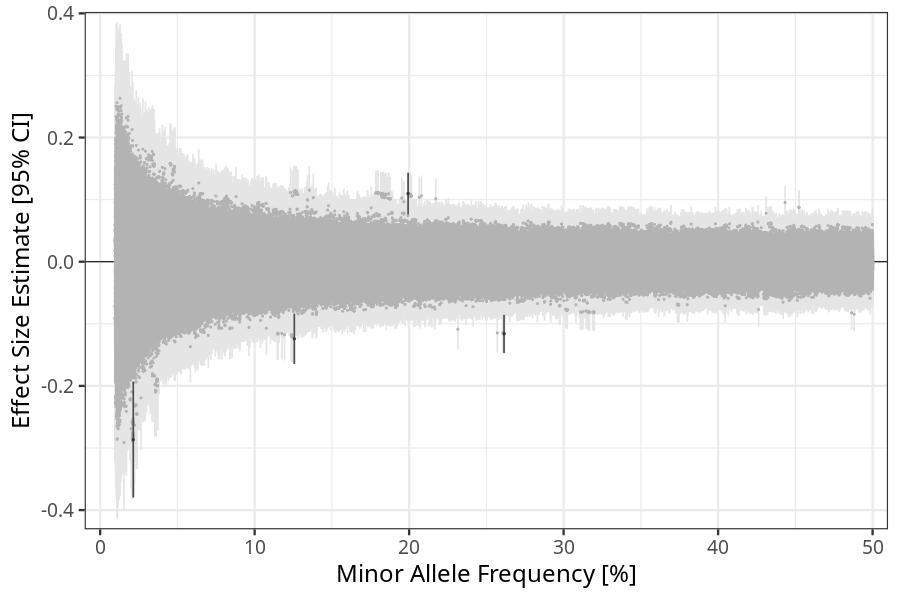
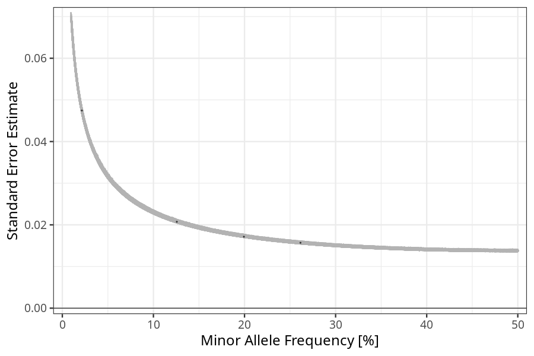

## nausea_vomiting in mothers
Association results by regenie for nausea_vomiting in mothers, followed by COJO analysis of the hits passing p < 5e-8.
### Manhattan

### Top hits
| SNP | chr | bp | ref | ref freq | beta | se | p | n | Ensembl | Phenoscanner | freq geno | b joint | b joint se | p joint | ld r |
| --- | --- | -- | --- | -------- | ---- | -- | - | - | ------- | ------------ | --------- | ------- | ---------- | ------- | ---- |
| rs4754750 | 11 | 101219804 | C | 0.199344 | 0.109841 | 0.017151 | 1.51012e-10 | 56392.1 | [[...]](ensembl/rs4754750.md) | No Results | 0.200288 | 0.109841 | 0.0171571 | 1.53276e-10 | 0 |
| rs35673587 | 19 | 18490927 | T | 0.125693 | -0.124192 | 0.0207358 | 2.10804e-09 | 56105.9 | [GDF15](ensembl/rs35673587.md) | [Granulocyte percentage of myeloid white cells, Monocyte percentage of white cells](phenoscanner/rs35673587.md) | 0.124891 | -0.167115 | 0.0212858 | 4.12705e-15 | -0.225333 |
| rs45543339 | 19 | 18503194 | T | 0.261435 | -0.116308 | 0.0156956 | 1.26081e-13 | 55714.3 | [LRRC25](ensembl/rs45543339.md) | [[...]](phenoscanner/rs45543339.md) | 0.259952 | -0.144717 | 0.0161147 | 2.69747e-19 | 0 |
| rs57452279 | 22 | 24878110 | C | 0.0214441 | -0.286646 | 0.0474494 | 1.53078e-09 | 56086.8 | [UPB1](ensembl/rs57452279.md) | No Results | 0.0213688 | -0.286646 | 0.0474644 | 1.54902e-09 | 0 |
### Quality Control
- QQ plot

- Beta vs. Allele Frequency

- Standard error vs. Allele Frequency

