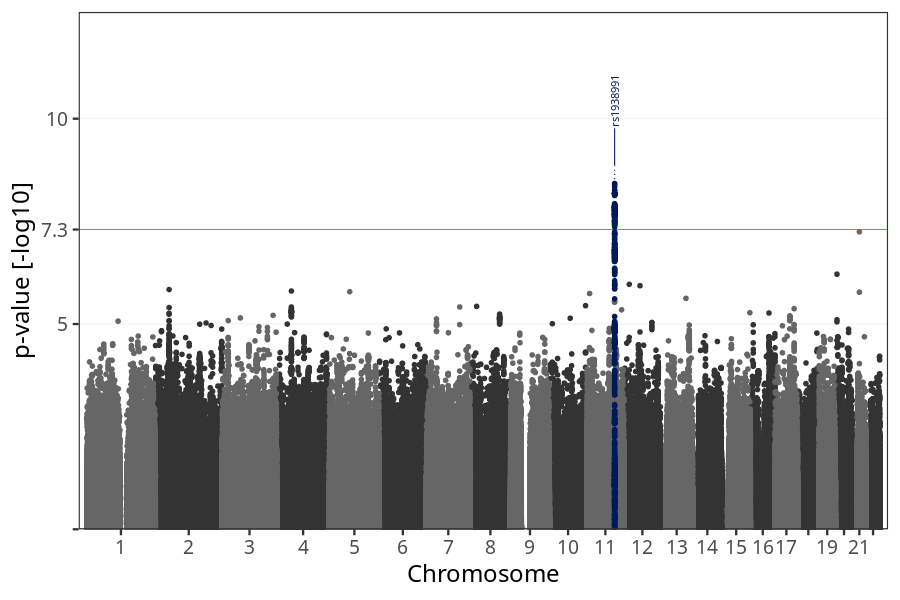
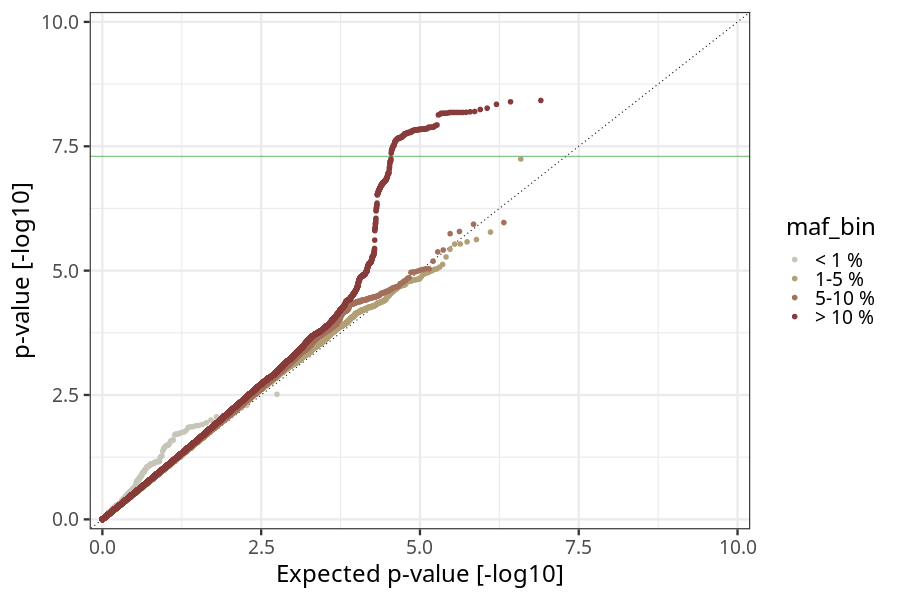
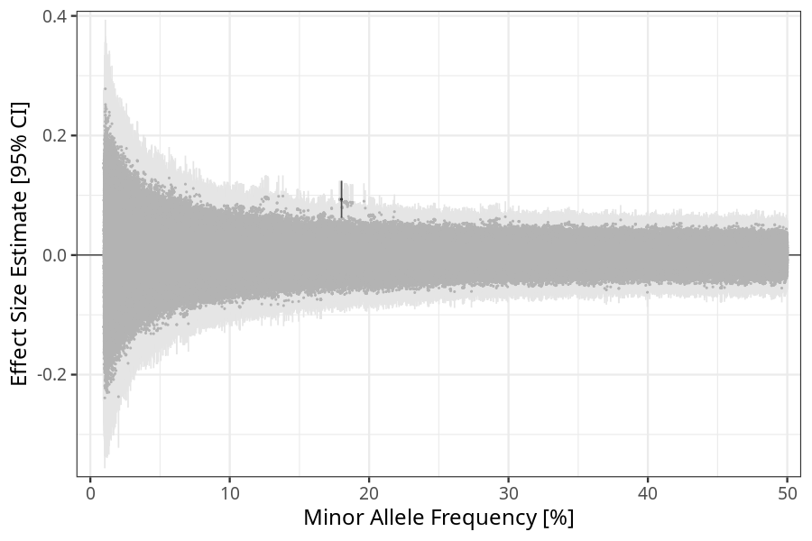
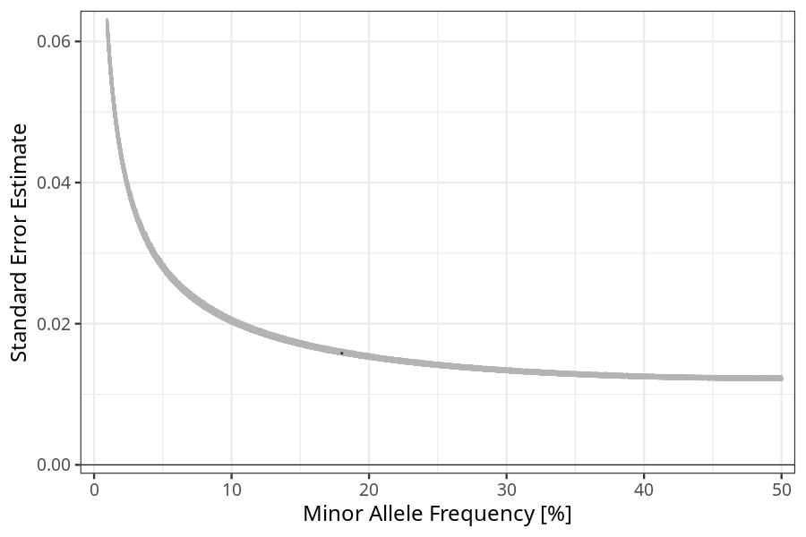

## nausea_vomiting_13w_15w in children
Association results by regenie for nausea_vomiting_13w_15w in children, followed by COJO analysis of the hits passing p < 5e-8.
### Manhattan

### Top hits
| SNP | chr | bp | ref | ref freq | beta | se | p | n | Ensembl | Phenoscanner | freq geno | b joint | b joint se | p joint | ld r |
| --- | --- | -- | --- | -------- | ---- | -- | - | - | ------- | ------------ | --------- | ------- | ---------- | ------- | ---- |
| rs1938991 | 11 | 101282893 | G | 0.180222 | 0.0932563 | 0.0158251 | 3.79394e-09 | 73288 | [TRPC6](ensembl/rs1938991.md) | No Results | 0.1815 | 0.0932563 | 0.0158287 | 3.82519e-09 | 0 |
### Quality Control
- QQ plot

- Beta vs. Allele Frequency

- Standard error vs. Allele Frequency

