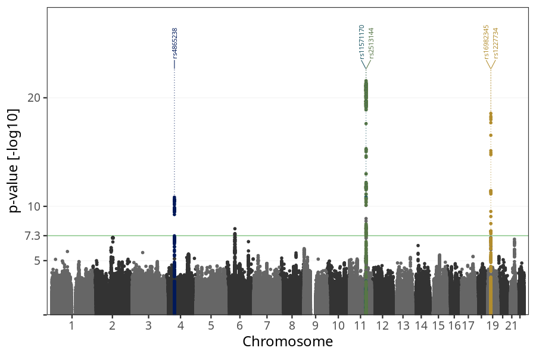
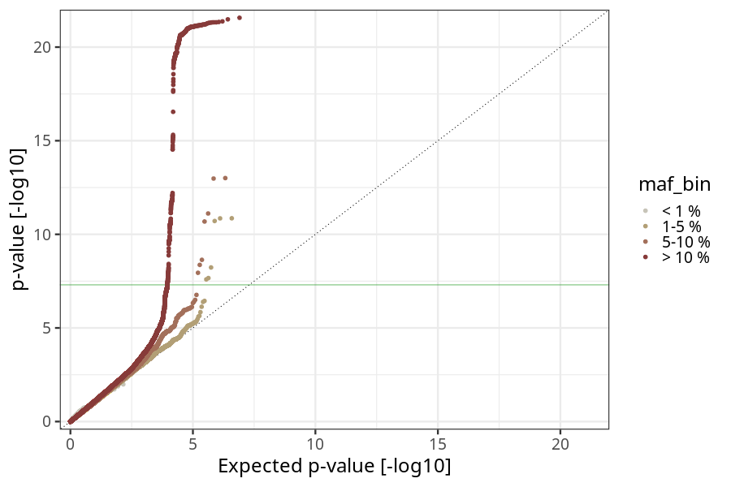
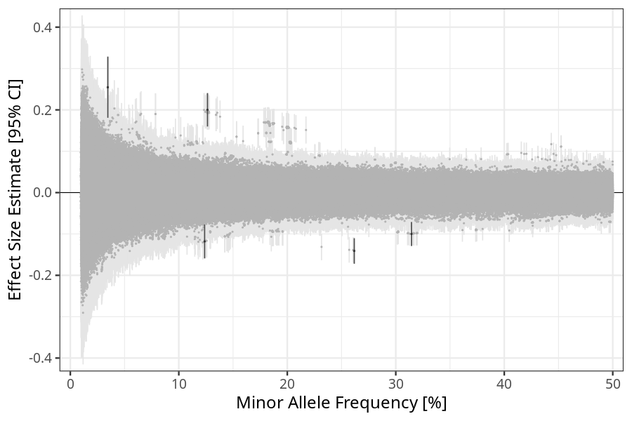
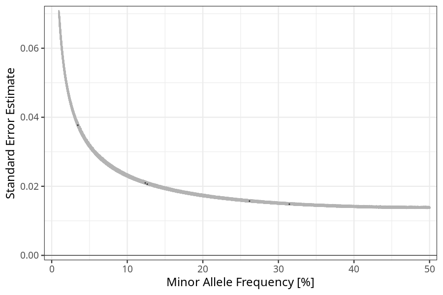

## nausea_vomiting_13w_15w in mothers
Association results by regenie for nausea_vomiting_13w_15w in mothers, followed by COJO analysis of the hits passing p < 5e-8.
### Manhattan

### Top hits
| SNP | chr | bp | ref | ref freq | beta | se | p | n | Ensembl | Phenoscanner | freq geno | b joint | b joint se | p joint | ld r |
| --- | --- | -- | --- | -------- | ---- | -- | - | - | ------- | ------------ | --------- | ------- | ---------- | ------- | ---- |
| rs4865238 | 4 | 58363165 | A | 0.314476 | -0.100094 | 0.0148247 | 1.45982e-11 | 56155 | [RP11-319E12.2](ensembl/rs4865238.md) | No Results | 0.31387 | -0.100094 | 0.0148306 | 1.48703e-11 | 0 |
| rs11571170 | 11 | 100975186 | A | 0.034579 | 0.254797 | 0.0377057 | 1.40374e-11 | 55988.3 | [PGR](ensembl/rs11571170.md) | No Results | 0.0346751 | 0.271618 | 0.0377581 | 6.30848e-13 | -0.0447074 |
| rs2513144 | 11 | 101259609 | C | 0.126443 | 0.200239 | 0.0206197 | 2.70528e-22 | 56535.3 | [TRPC6](ensembl/rs2513144.md) | No Results | 0.126298 | 0.20685 | 0.0206572 | 1.32975e-23 | 0 |
| rs16982345 | 19 | 18500722 | A | 0.261736 | -0.141116 | 0.0157181 | 2.75909e-19 | 55784.8 | [GDF15](ensembl/rs16982345.md) | [[...]](phenoscanner/rs16982345.md) | 0.260608 | -0.169462 | 0.01614 | 8.68571e-26 | -0.224343 |
| rs1227734 | 19 | 18501034 | T | 0.123799 | -0.117979 | 0.0209709 | 1.84604e-08 | 55874.9 | [LRRC25](ensembl/rs1227734.md) | [Granulocyte percentage of myeloid white cells, Monocyte percentage of white cells](phenoscanner/rs1227734.md) | 0.123115 | -0.168639 | 0.0215244 | 4.69737e-15 | 0 |
### Quality Control
- QQ plot

- Beta vs. Allele Frequency

- Standard error vs. Allele Frequency

