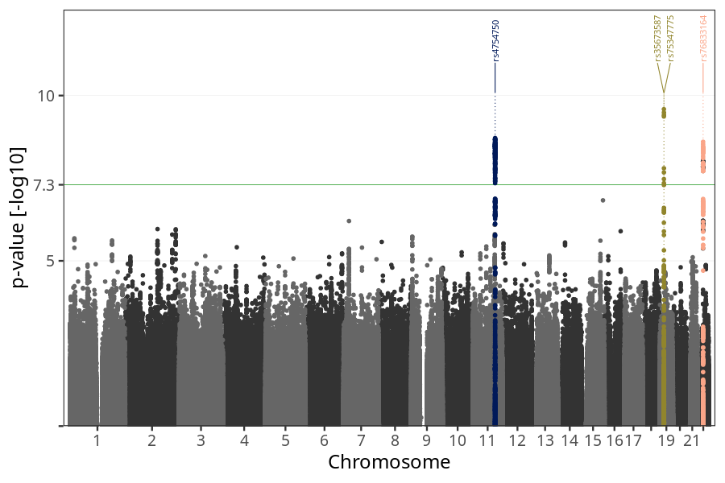
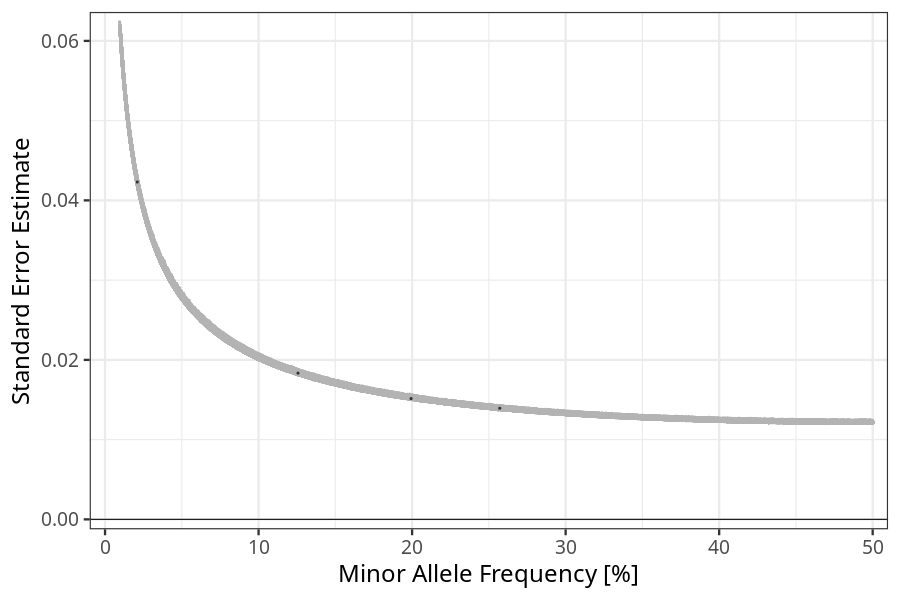

## nausea_vomiting_5w_8w in mothers
Association results by regenie for nausea_vomiting_5w_8w in mothers, followed by COJO analysis of the hits passing p < 5e-8.
### Manhattan

### Top hits
| SNP | chr | bp | ref | ref freq | beta | se | p | n | Ensembl | Phenoscanner | freq geno | b joint | b joint se | p joint | ld r |
| --- | --- | -- | --- | -------- | ---- | -- | - | - | ------- | ------------ | --------- | ------- | ---------- | ------- | ---- |
| rs4754750 | 11 | 101219804 | C | 0.199344 | 0.0909407 | 0.015147 | 1.92663e-09 | 56429.9 | [[...]](ensembl/rs4754750.md) | No Results | 0.200288 | 0.0909407 | 0.0151517 | 1.94887e-09 | 0 |
| rs35673587 | 19 | 18490927 | T | 0.125693 | -0.0797115 | 0.0183359 | 1.37829e-05 | 56077.4 | [GDF15](ensembl/rs35673587.md) | [Granulocyte percentage of myeloid white cells, Monocyte percentage of white cells](phenoscanner/rs35673587.md) | 0.124891 | -0.111291 | 0.0188179 | 3.33717e-09 | -0.224543 |
| rs75347775 | 19 | 18495908 | A | 0.257072 | -0.0880412 | 0.0139267 | 2.58607e-10 | 55912.1 | [GDF15](ensembl/rs75347775.md) | [[...]](phenoscanner/rs75347775.md) | 0.256208 | -0.106997 | 0.0142955 | 7.17263e-14 | 0 |
| rs76833164 | 22 | 24894242 | G | 0.0209979 | -0.252158 | 0.0423031 | 2.5109e-09 | 56260.1 | [UPB1](ensembl/rs76833164.md) | No Results | 0.0208347 | -0.252158 | 0.0423161 | 2.53915e-09 | 0 |
### Quality Control
- QQ plot

- Beta vs. Allele Frequency

- Standard error vs. Allele Frequency

