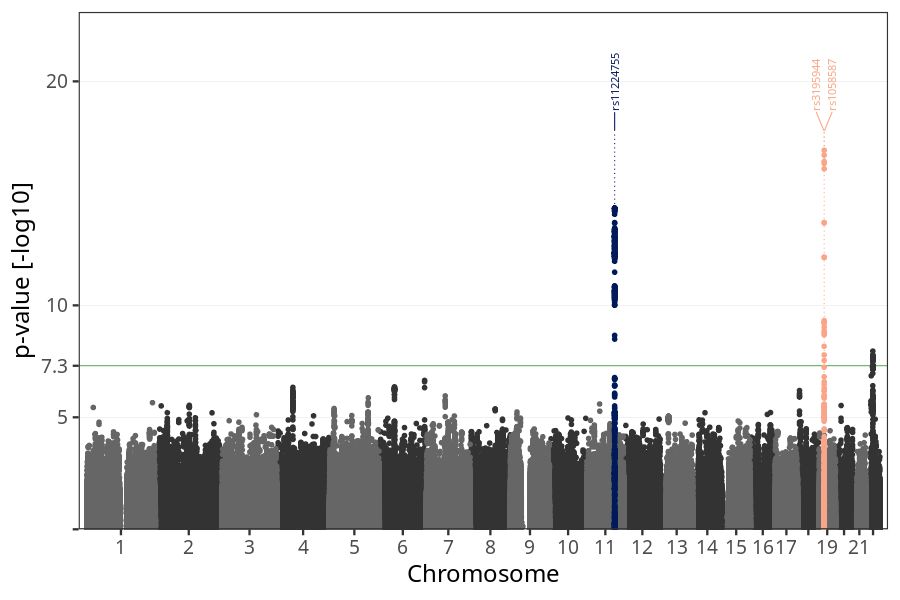

## nausea_vomiting_9w_12w in mothers
Association results by regenie for nausea_vomiting_9w_12w in mothers, followed by COJO analysis of the hits passing p < 5e-8.
### Manhattan

### Top hits
| SNP | chr | bp | ref | ref freq | beta | se | p | n | Ensembl | Phenoscanner | freq geno | b joint | b joint se | p joint | ld r |
| --- | --- | -- | --- | -------- | ---- | -- | - | - | ------- | ------------ | --------- | ------- | ---------- | ------- | ---- |
| rs11224755 | 11 | 101294435 | G | 0.179847 | 0.122042 | 0.0155708 | 4.58231e-15 | 56427.9 | [TRPC6](ensembl/rs11224755.md) | No Results | 0.181003 | 0.122042 | 0.0155791 | 4.73785e-15 | 0 |
| rs3195944 | 19 | 18476711 | G | 0.114706 | -0.0991771 | 0.0188967 | 1.53441e-07 | 55772.6 | [PGPEP1](ensembl/rs3195944.md) | [Granulocyte percentage of myeloid white cells, Monocyte percentage of white cells](phenoscanner/rs3195944.md) | 0.113357 | -0.139803 | 0.0193426 | 4.91039e-13 | -0.212506 |
| rs1058587 | 19 | 18499422 | G | 0.261489 | -0.11711 | 0.0136909 | 1.19042e-17 | 55826.1 | [GDF15](ensembl/rs1058587.md) | [[...]](phenoscanner/rs1058587.md) | 0.26042 | -0.138633 | 0.0140196 | 4.67062e-23 | 0 |
### Quality Control
- QQ plot

- Beta vs. Allele Frequency

- Standard error vs. Allele Frequency

