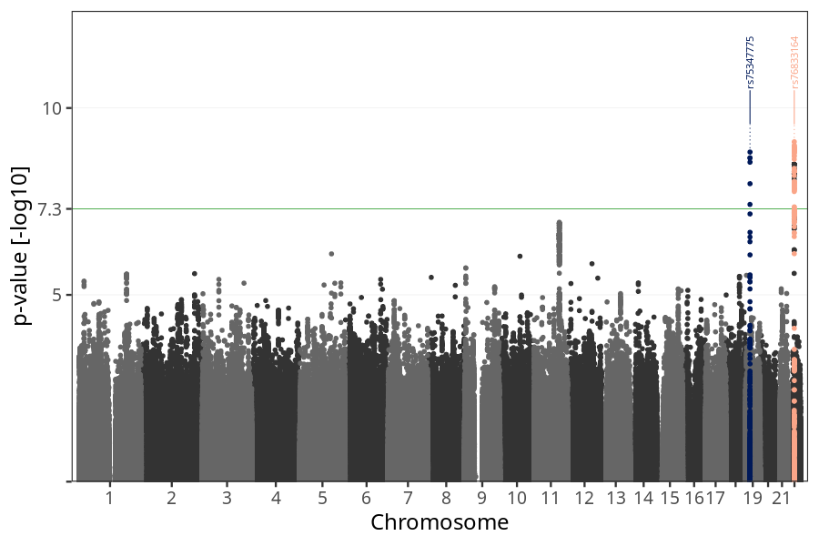
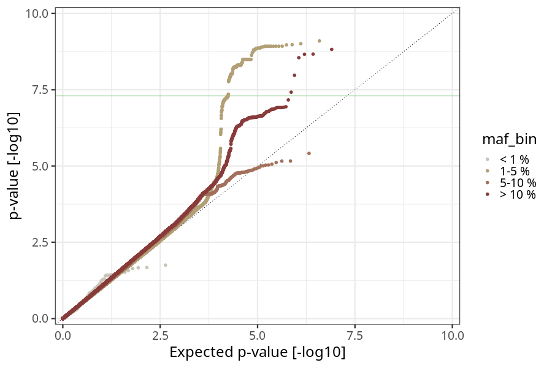
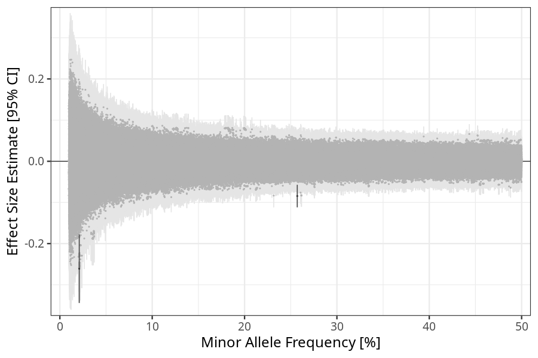
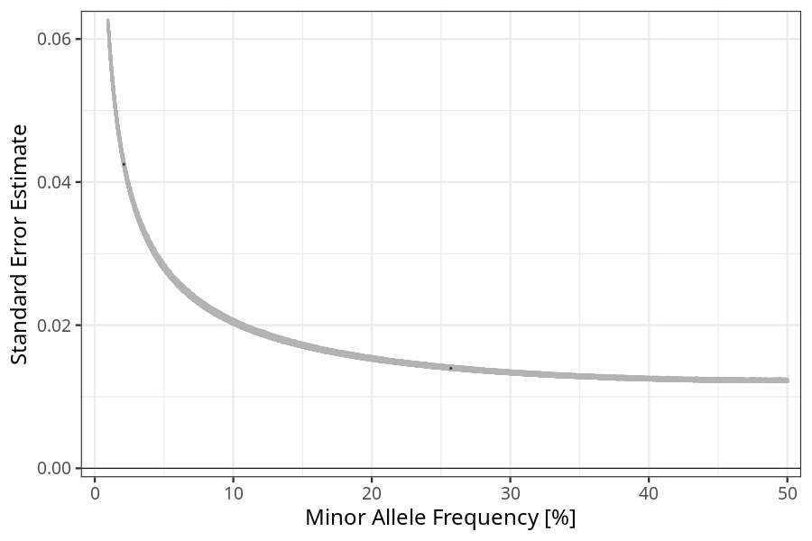

## nausea_vomiting_before_8w in mothers
Association results by regenie for nausea_vomiting_before_8w in mothers, followed by COJO analysis of the hits passing p < 5e-8.
### Manhattan

### Top hits
| SNP | chr | bp | ref | ref freq | beta | se | p | n | Ensembl | Phenoscanner | freq geno | b joint | b joint se | p joint | ld r |
| --- | --- | -- | --- | -------- | ---- | -- | - | - | ------- | ------------ | --------- | ------- | ---------- | ------- | ---- |
| rs75347775 | 19 | 18495908 | A | 0.257072 | -0.0844553 | 0.0139749 | 1.50941e-09 | 55932.1 | [GDF15](ensembl/rs75347775.md) | [[...]](phenoscanner/rs75347775.md) | 0.256208 | -0.0844553 | 0.0139793 | 1.52747e-09 | 0 |
| rs76833164 | 22 | 24894242 | G | 0.0209979 | -0.261058 | 0.0424817 | 7.98693e-10 | 56191.3 | [UPB1](ensembl/rs76833164.md) | No Results | 0.0208347 | -0.261058 | 0.0424956 | 8.08866e-10 | 0 |
### Quality Control
- QQ plot

- Beta vs. Allele Frequency

- Standard error vs. Allele Frequency

