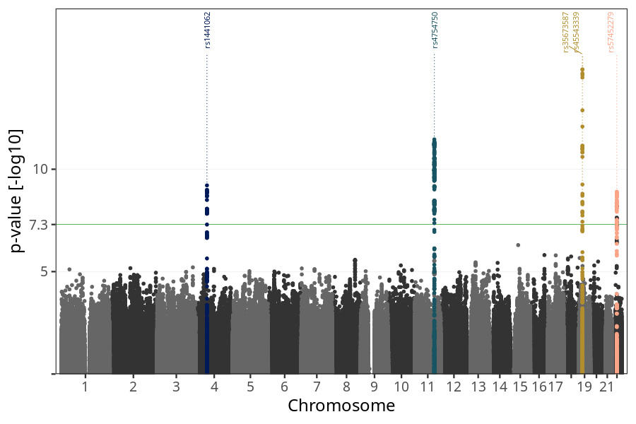
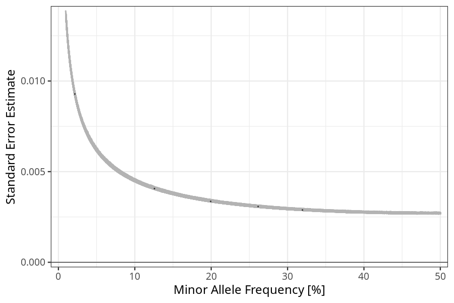

## nausea_vomiting_strength in mothers
Association results by regenie for nausea_vomiting_strength in mothers, followed by COJO analysis of the hits passing p < 5e-8.
### Manhattan

### Top hits
| SNP | chr | bp | ref | ref freq | beta | se | p | n | Ensembl | Phenoscanner | freq geno | b joint | b joint se | p joint | ld r |
| --- | --- | -- | --- | -------- | ---- | -- | - | - | ------- | ------------ | --------- | ------- | ---------- | ------- | ---- |
| rs1441062 | 4 | 58349889 | C | 0.319517 | -0.0178427 | 0.00288421 | 6.15776e-10 | 56262.7 | [RP11-319E12.2](ensembl/rs1441062.md) | No Results | 0.318951 | -0.0178427 | 0.00288517 | 6.23823e-10 | 0 |
| rs4754750 | 11 | 101219804 | C | 0.199344 | 0.0233741 | 0.00336024 | 3.4987e-12 | 56406.4 | [[...]](ensembl/rs4754750.md) | No Results | 0.200288 | 0.0233741 | 0.00336165 | 3.57192e-12 | 0 |
| rs35673587 | 19 | 18490927 | T | 0.125693 | -0.0243949 | 0.00406556 | 1.96858e-09 | 56063.1 | [GDF15](ensembl/rs35673587.md) | [Granulocyte percentage of myeloid white cells, Monocyte percentage of white cells](phenoscanner/rs35673587.md) | 0.124891 | -0.0333762 | 0.0041735 | 1.27323e-15 | -0.225333 |
| rs45543339 | 19 | 18503194 | T | 0.261435 | -0.0245797 | 0.00307573 | 1.33305e-15 | 55721.9 | [LRRC25](ensembl/rs45543339.md) | [[...]](phenoscanner/rs45543339.md) | 0.259952 | -0.0302535 | 0.00315819 | 9.76257e-22 | 0 |
| rs57452279 | 22 | 24878110 | C | 0.0214441 | -0.0563723 | 0.00928405 | 1.26365e-09 | 56230.9 | [UPB1](ensembl/rs57452279.md) | No Results | 0.0213688 | -0.0563723 | 0.00928701 | 1.27898e-09 | 0 |
### Quality Control
- QQ plot

- Beta vs. Allele Frequency

- Standard error vs. Allele Frequency

