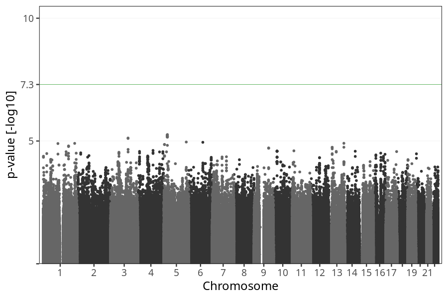
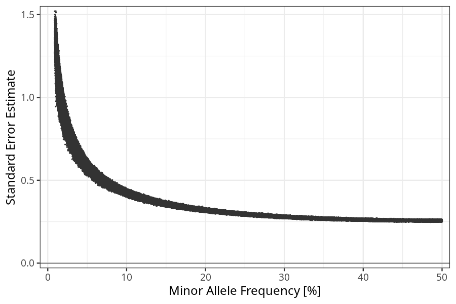

## hg_vs_no_nausea_vomiting_21_24w in children
Association results by regenie for hg_vs_no_nausea_vomiting_21_24w in children.
### Manhattan

### QQ plot

### Beta vs. Allele Frequency

### Standard error vs. Allele Frequency

