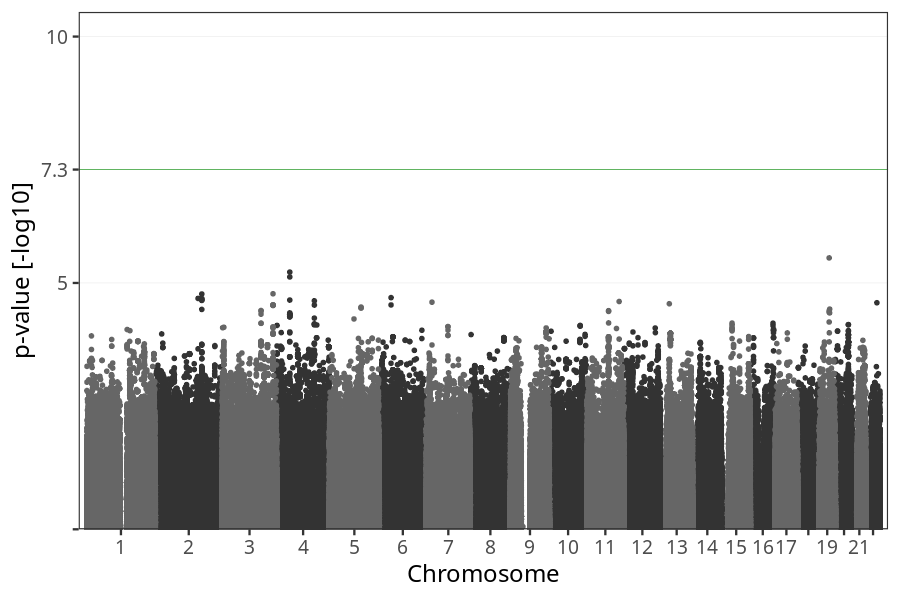
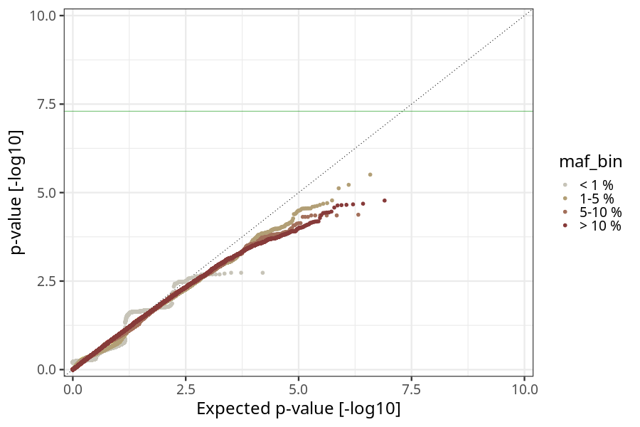
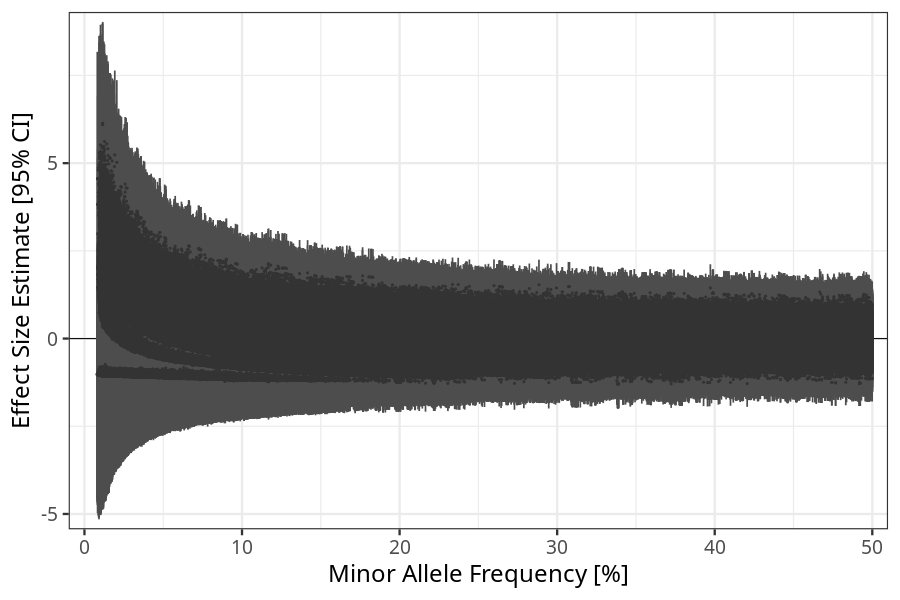
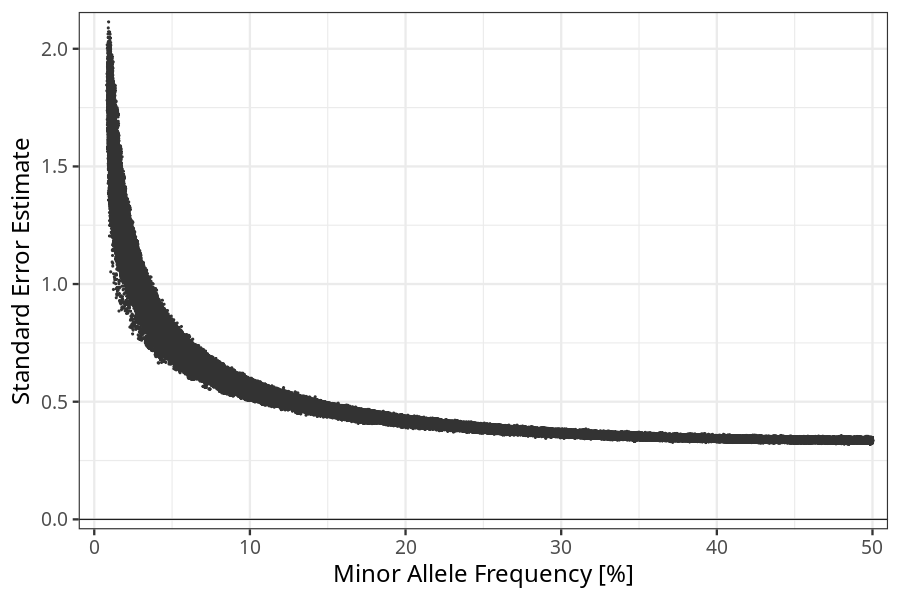

## hg_vs_no_nausea_vomiting_25_28w in fathers
Association results by regenie for hg_vs_no_nausea_vomiting_25_28w in fathers.
### Manhattan

### QQ plot

### Beta vs. Allele Frequency

### Standard error vs. Allele Frequency

