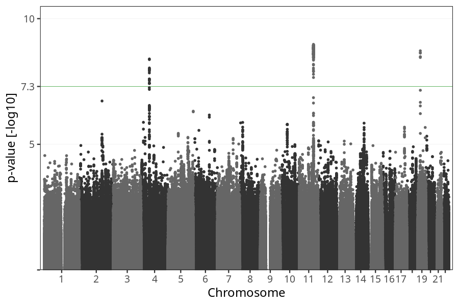
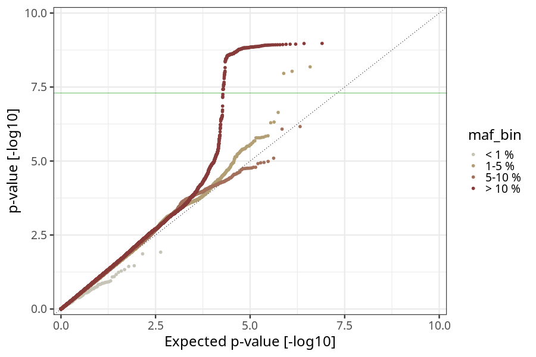
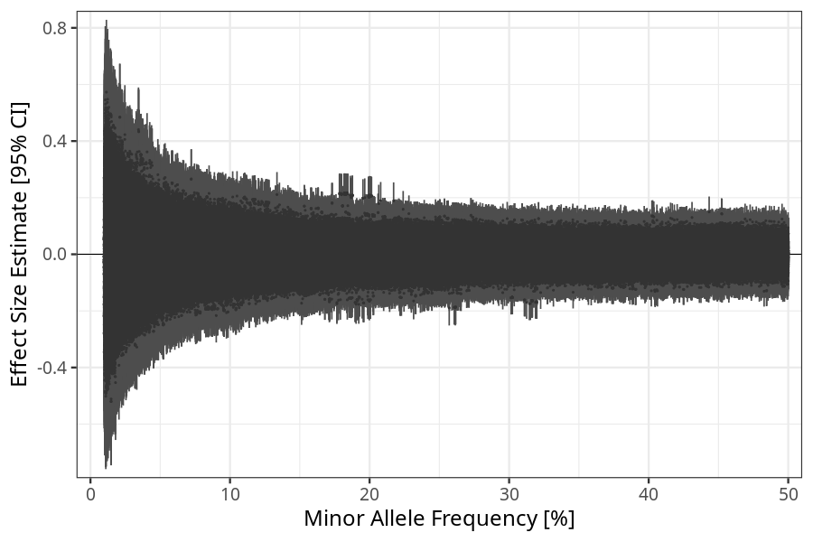
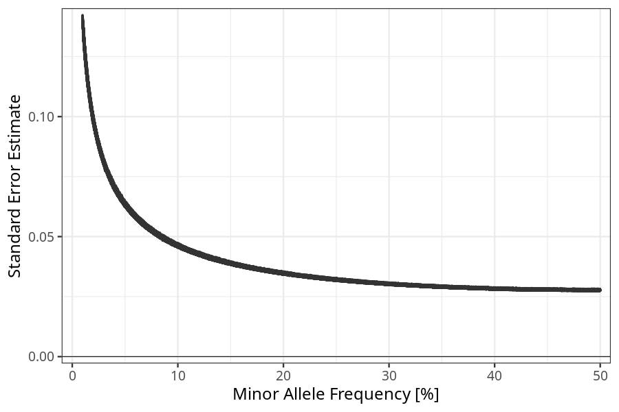

## long_term_nausea_vomiting_17w_20w in mothers
Association results by regenie for long_term_nausea_vomiting_17w_20w in mothers.
### Manhattan

### QQ plot

### Beta vs. Allele Frequency

### Standard error vs. Allele Frequency

