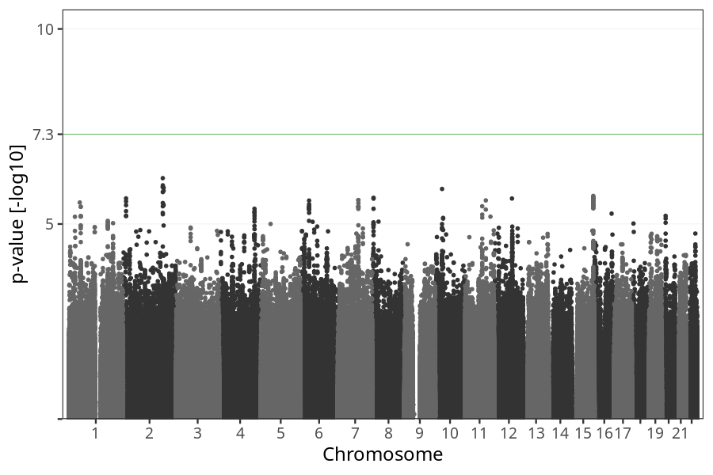
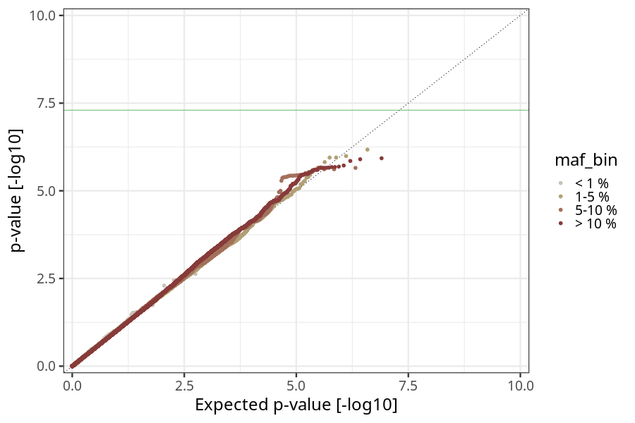
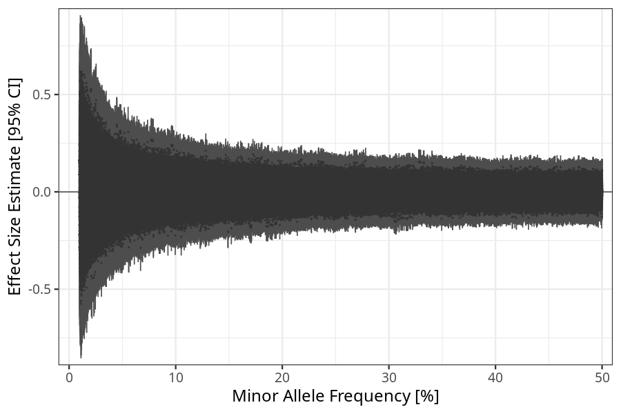
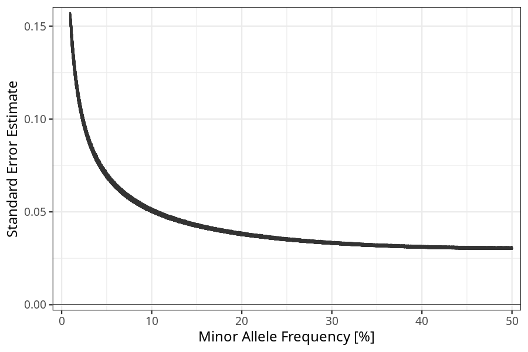

## long_term_nausea_vomiting_after_21w in children
Association results by regenie for long_term_nausea_vomiting_after_21w in children.
### Manhattan

### QQ plot

### Beta vs. Allele Frequency

### Standard error vs. Allele Frequency

