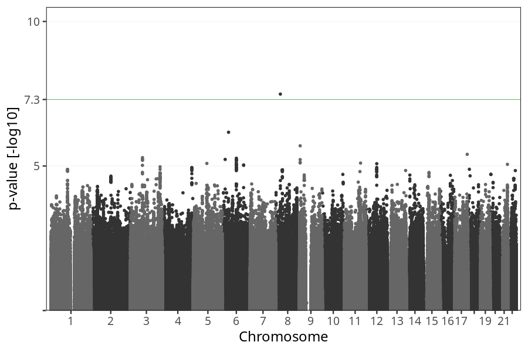
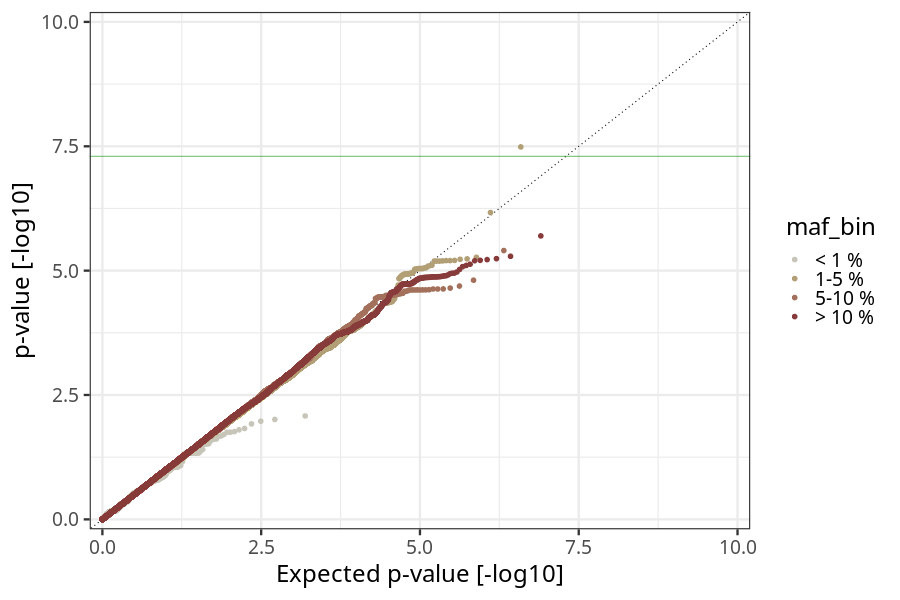
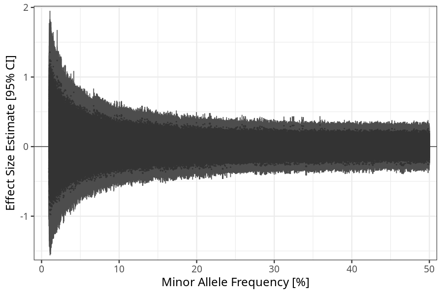
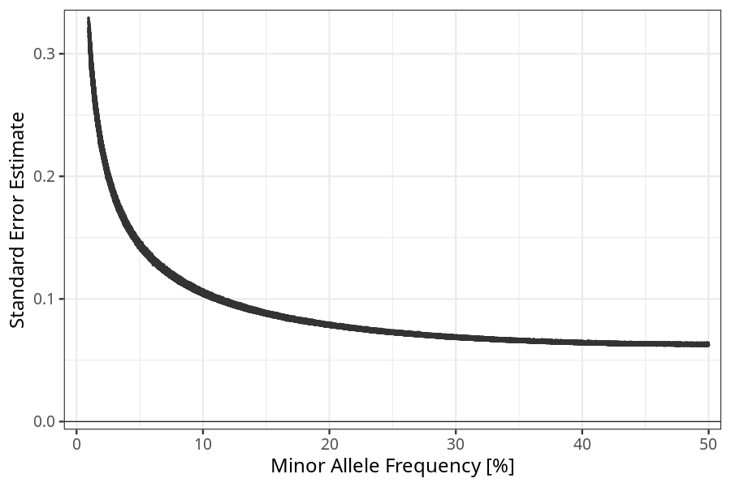

## long_term_nausea_vomiting_after_29w in fathers
Association results by regenie for long_term_nausea_vomiting_after_29w in fathers.
### Manhattan

### QQ plot

### Beta vs. Allele Frequency

### Standard error vs. Allele Frequency

