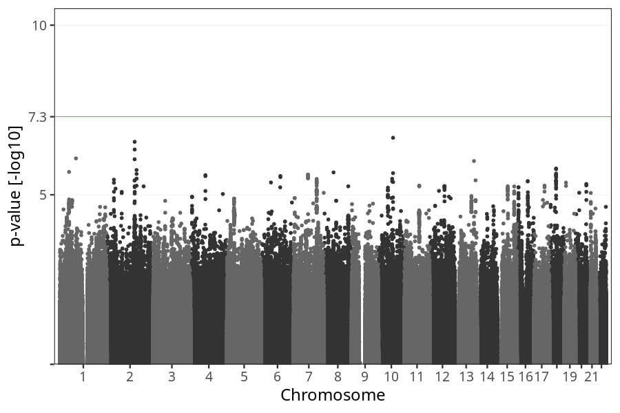
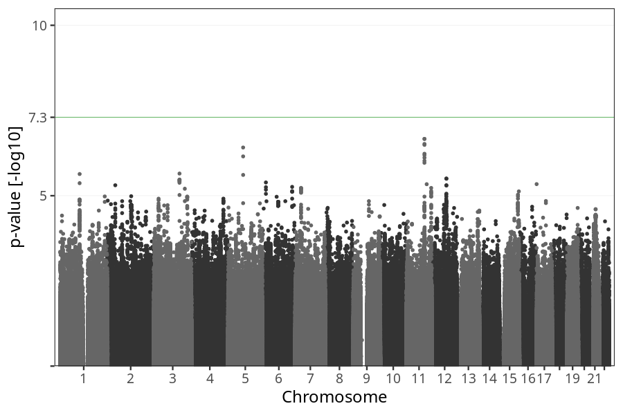
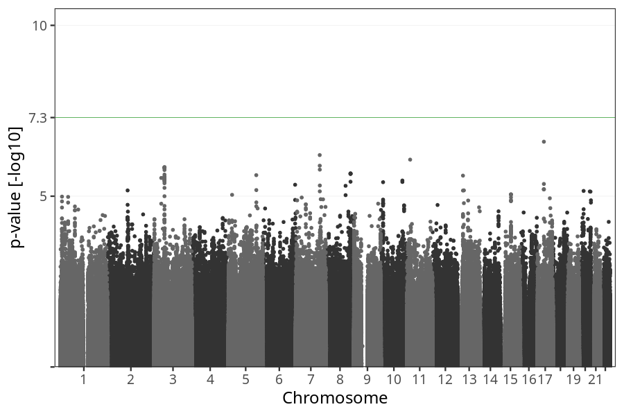

# Vomiting before week 4
GWAS of participants of pregnancies where the mother reported vomiting before week 4.

### children

#### Phenotypes
| Value | N |
| ----- | - |
| 0 | 68290 |
| 1 | 5099 |
| Total | 73389 |

#### Association results

- [Association results](regenie/vomiting_before_4w/pop_children_pheno_vomiting_before_4w.md)
- [Results prior to COJO](regenie_no_cojo/vomiting_before_4w/pop_children_pheno_vomiting_before_4w.md)

### mothers

#### Phenotypes
| Value | N |
| ----- | - |
| 0 | 52313 |
| 1 | 3912 |
| Total | 56225 |

#### Association results

- [Association results](regenie/vomiting_before_4w/pop_mothers_pheno_vomiting_before_4w.md)
- [Results prior to COJO](regenie_no_cojo/vomiting_before_4w/pop_mothers_pheno_vomiting_before_4w.md)

### fathers

#### Phenotypes
| Value | N |
| ----- | - |
| 0 | 35810 |
| 1 | 2642 |
| Total | 38452 |

#### Association results

- [Association results](regenie/vomiting_before_4w/pop_fathers_pheno_vomiting_before_4w.md)
- [Results prior to COJO](regenie_no_cojo/vomiting_before_4w/pop_fathers_pheno_vomiting_before_4w.md)

