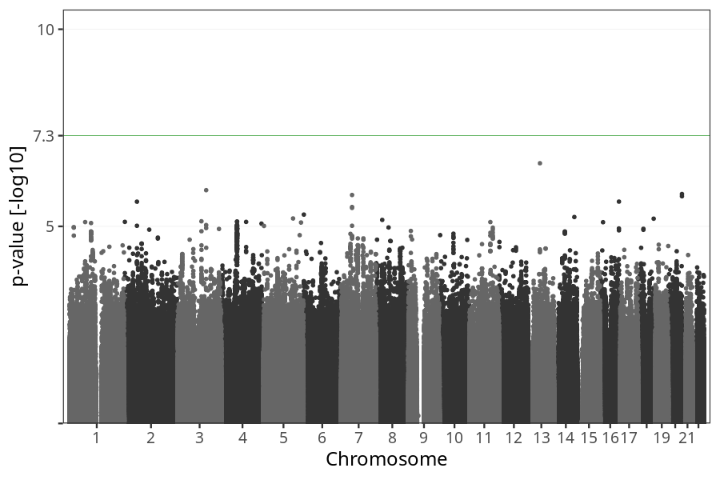
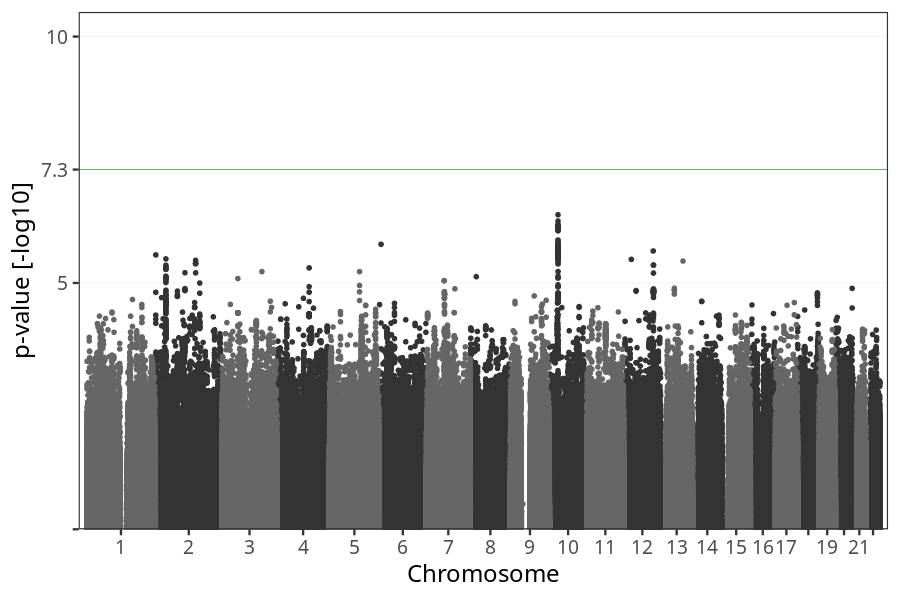
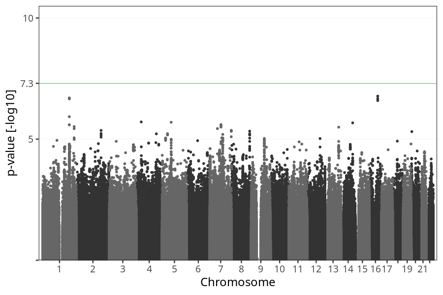

# Vomiting duration
GWAS of participants of pregnancies against the duration in weeks where mothers reported suffering from vomiting.

### children

#### Phenotypes
| Quantile | Value |
| -------- | ----- |
| 1% | 0 |
| 5% | 1 |
| 10% | 2 |
| 25% | 4 |
| 50% | 6 |
| 75% | 9 |
| 90% | 12 |
| 95% | 13 |
| 99% | 17 |
| N | 15297 |

#### Association results

- [Association results](regenie/vomiting_duration/pop_children_pheno_vomiting_duration.md)
- [Results prior to COJO](regenie_no_cojo/vomiting_duration/pop_children_pheno_vomiting_duration.md)

### mothers

#### Phenotypes
| Quantile | Value |
| -------- | ----- |
| 1% | 0 |
| 5% | 1 |
| 10% | 2 |
| 25% | 4 |
| 50% | 6 |
| 75% | 9 |
| 90% | 12 |
| 95% | 13 |
| 99% | 17 |
| N | 11656 |

#### Association results

- [Association results](regenie/vomiting_duration/pop_mothers_pheno_vomiting_duration.md)
- [Results prior to COJO](regenie_no_cojo/vomiting_duration/pop_mothers_pheno_vomiting_duration.md)

### fathers

#### Phenotypes
| Quantile | Value |
| -------- | ----- |
| 1% | 0 |
| 5% | 1 |
| 10% | 2 |
| 25% | 4 |
| 50% | 6 |
| 75% | 9 |
| 90% | 12 |
| 95% | 13 |
| 99% | 17 |
| N | 8597 |

#### Association results

- [Association results](regenie/vomiting_duration/pop_fathers_pheno_vomiting_duration.md)
- [Results prior to COJO](regenie_no_cojo/vomiting_duration/pop_fathers_pheno_vomiting_duration.md)

