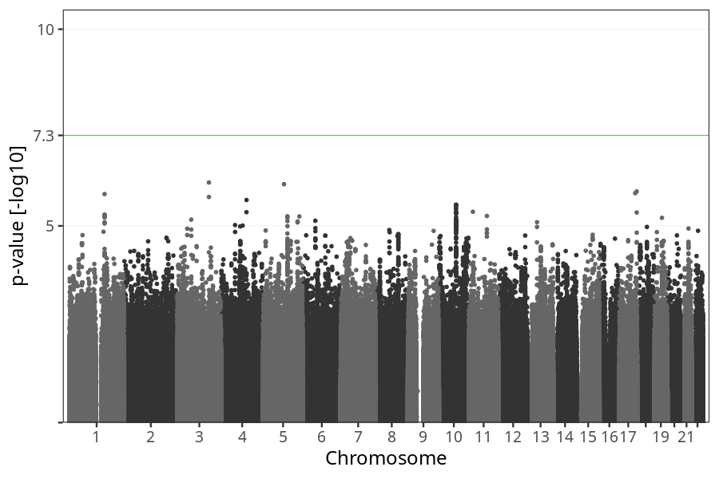

# Vomiting start
GWAS of participants of pregnancies against the week where mothers reported beginning to suffer from vomiting.

### children

#### Phenotypes
| Quantile | Value |
| -------- | ----- |
| 1% | 0 |
| 5% | 3 |
| 10% | 4 |
| 25% | 5 |
| 50% | 7 |
| 75% | 9 |
| 90% | 10 |
| 95% | 12 |
| 99% | 16 |
| N | 16129 |

#### Association results

- [Association results](regenie/vomiting_week_from/pop_children_pheno_vomiting_week_from_q2.md)
- [Results prior to COJO](regenie_no_cojo/vomiting_week_from/pop_children_pheno_vomiting_week_from_q2.md)

### mothers

#### Phenotypes
| Quantile | Value |
| -------- | ----- |
| 1% | 0 |
| 5% | 3 |
| 10% | 4 |
| 25% | 5 |
| 50% | 7 |
| 75% | 9 |
| 90% | 10 |
| 95% | 12 |
| 99% | 16 |
| N | 12278 |

#### Association results

- [Association results](regenie/vomiting_week_from/pop_mothers_pheno_vomiting_week_from_q2.md)
- [Results prior to COJO](regenie_no_cojo/vomiting_week_from/pop_mothers_pheno_vomiting_week_from_q2.md)

### fathers

#### Phenotypes
| Quantile | Value |
| -------- | ----- |
| 1% | 0 |
| 5% | 3 |
| 10% | 4 |
| 25% | 5 |
| 50% | 7 |
| 75% | 9 |
| 90% | 10 |
| 95% | 12 |
| 99% | 16 |
| N | 9024 |

#### Association results

- [Association results](regenie/vomiting_week_from/pop_fathers_pheno_vomiting_week_from_q2.md)
- [Results prior to COJO](regenie_no_cojo/vomiting_week_from/pop_fathers_pheno_vomiting_week_from_q2.md)

