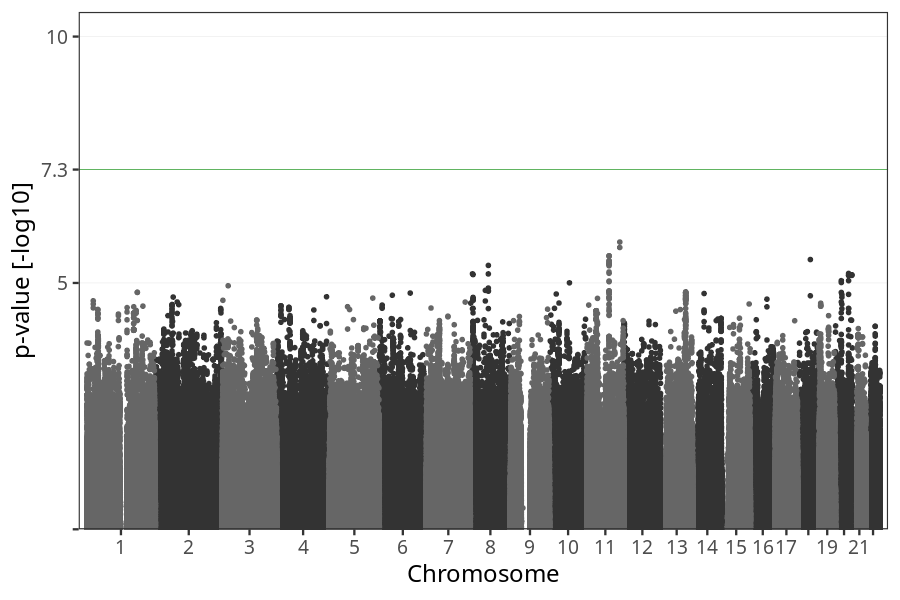
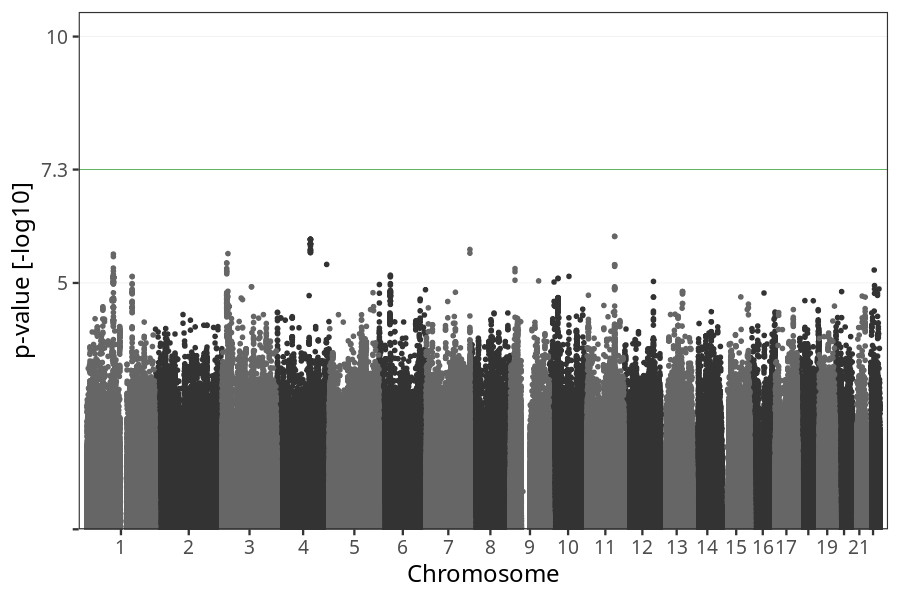
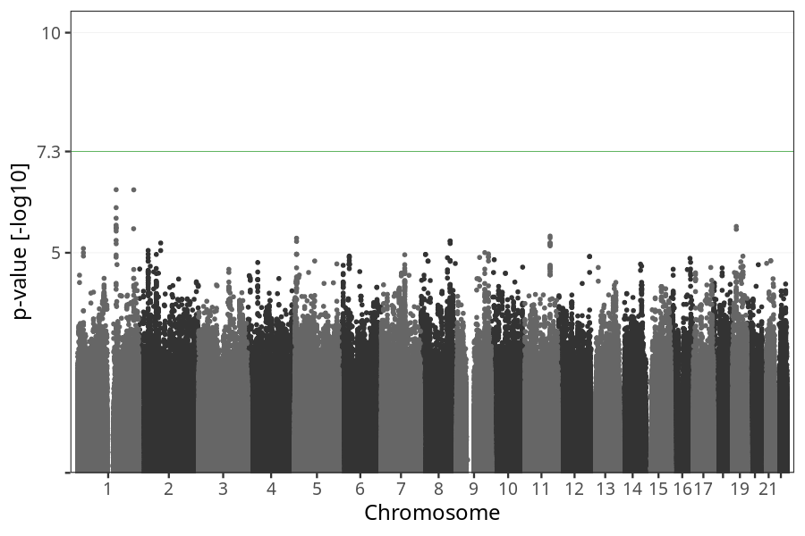

# Vomiting end
GWAS of participants of pregnancies against the week where mothers reported ending to suffer from vomiting.

### children

#### Phenotypes
| Quantile | Value |
| -------- | ----- |
| 1% | 2 |
| 5% | 8 |
| 10% | 10 |
| 25% | 12 |
| 50% | 13 |
| 75% | 16 |
| 90% | 18 |
| 95% | 20 |
| 99% | 23 |
| N | 15380 |

#### Association results

- [Association results](regenie/vomiting_week_to/pop_children_pheno_vomiting_week_to_q2.md)
- [Results prior to COJO](regenie_no_cojo/vomiting_week_to/pop_children_pheno_vomiting_week_to_q2.md)

### mothers

#### Phenotypes
| Quantile | Value |
| -------- | ----- |
| 1% | 2.21000000000001 |
| 5% | 8 |
| 10% | 10 |
| 25% | 12 |
| 50% | 14 |
| 75% | 16 |
| 90% | 18 |
| 95% | 20 |
| 99% | 23 |
| N | 11722 |

#### Association results

- [Association results](regenie/vomiting_week_to/pop_mothers_pheno_vomiting_week_to_q2.md)
- [Results prior to COJO](regenie_no_cojo/vomiting_week_to/pop_mothers_pheno_vomiting_week_to_q2.md)

### fathers

#### Phenotypes
| Quantile | Value |
| -------- | ----- |
| 1% | 3 |
| 5% | 8 |
| 10% | 10 |
| 25% | 12 |
| 50% | 14 |
| 75% | 16 |
| 90% | 18 |
| 95% | 20 |
| 99% | 22 |
| N | 8645 |

#### Association results

- [Association results](regenie/vomiting_week_to/pop_fathers_pheno_vomiting_week_to_q2.md)
- [Results prior to COJO](regenie_no_cojo/vomiting_week_to/pop_fathers_pheno_vomiting_week_to_q2.md)

