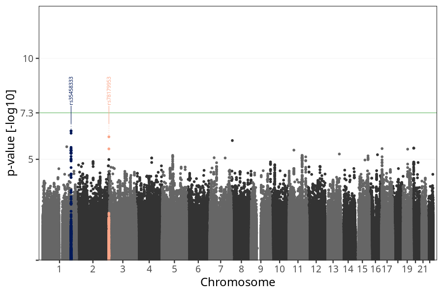
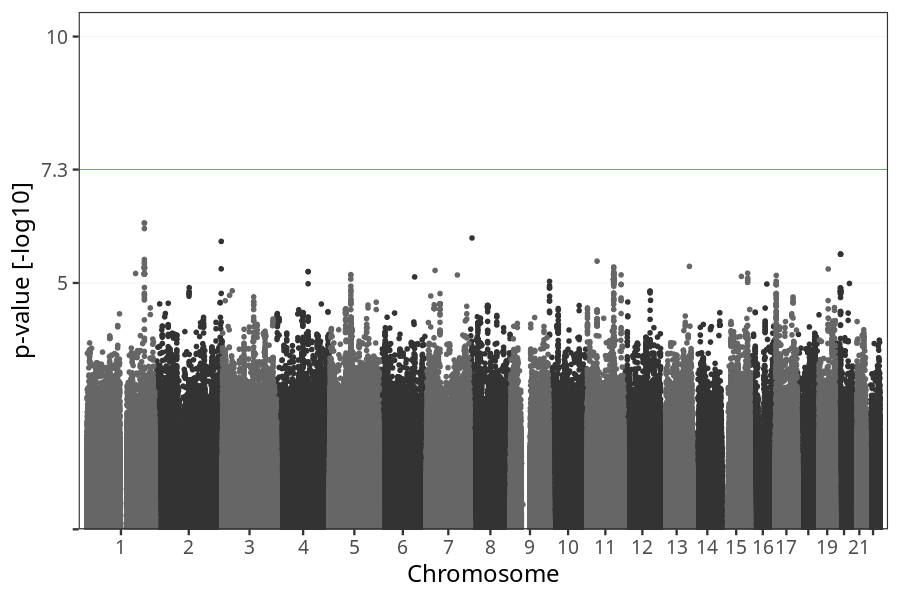
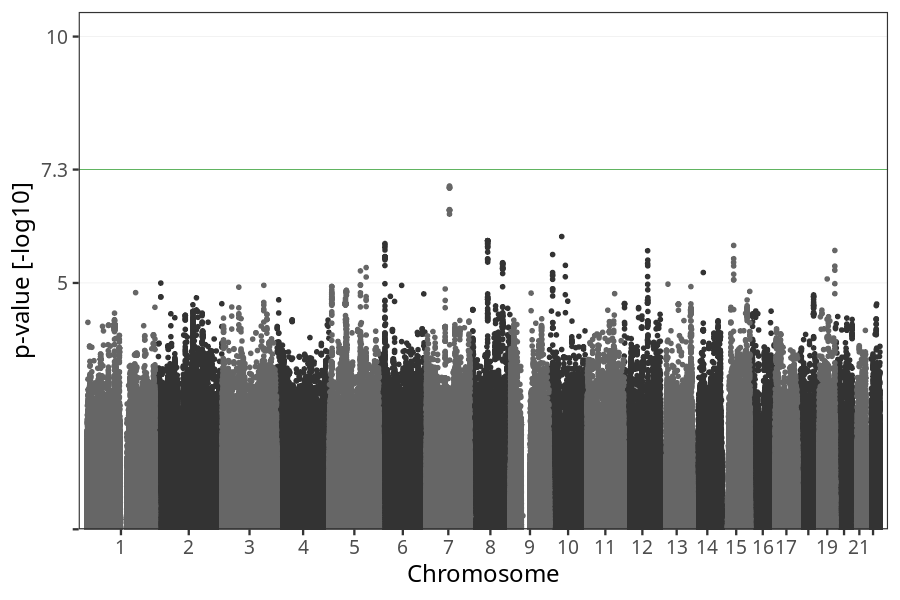
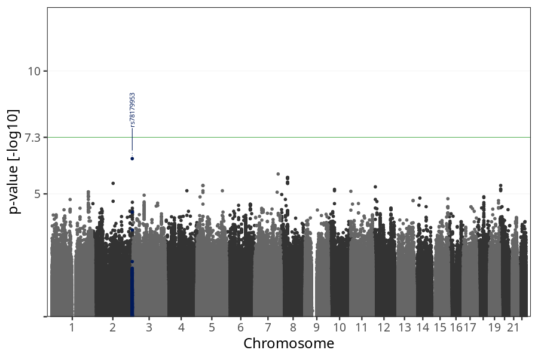
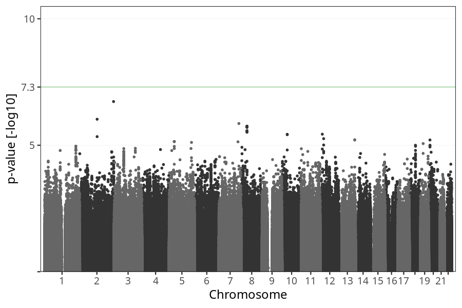

# Hyperemesis gravidarum
GWAS of mothers hospitalized due to prolonged nausea and vomiting.

### children

#### Phenotypes
| Value | N |
| ----- | - |
| 0 | 72641 |
| 1 | 748 |
| Total | 73389 |

#### Association results
- [Association results](regenie/pop_children_pheno_hyperemesis_gravidarum/pop_children_pheno_hyperemesis_gravidarum.md)

Results prior to COJO are available [here](regenie_no_cojo/pop_children_pheno_hyperemesis_gravidarum/pop_children_pheno_hyperemesis_gravidarum.md)

### children_nausea_vomiting

#### Phenotypes
| Value | N |
| ----- | - |
| 0 | 54051 |
| 1 | 739 |
| Total | 54790 |

#### Association results
- [Association results](regenie/pop_children_nausea_vomiting_pheno_hyperemesis_gravidarum/pop_children_nausea_vomiting_pheno_hyperemesis_gravidarum.md)

Results prior to COJO are available [here](regenie_no_cojo/pop_children_nausea_vomiting_pheno_hyperemesis_gravidarum/pop_children_nausea_vomiting_pheno_hyperemesis_gravidarum.md)

### mothers

#### Phenotypes
| Value | N |
| ----- | - |
| 0 | 55648 |
| 1 | 577 |
| Total | 56225 |

#### Association results
- [Association results](regenie/pop_mothers_pheno_hyperemesis_gravidarum/pop_mothers_pheno_hyperemesis_gravidarum.md)

Results prior to COJO are available [here](regenie_no_cojo/pop_mothers_pheno_hyperemesis_gravidarum/pop_mothers_pheno_hyperemesis_gravidarum.md)

### mothers_nausea_vomiting

#### Phenotypes
| Value | N |
| ----- | - |
| 0 | 41287 |
| 1 | 571 |
| Total | 41858 |

#### Association results
- [Association results](regenie/pop_mothers_nausea_vomiting_pheno_hyperemesis_gravidarum/pop_mothers_nausea_vomiting_pheno_hyperemesis_gravidarum.md)

Results prior to COJO are available [here](regenie_no_cojo/pop_mothers_nausea_vomiting_pheno_hyperemesis_gravidarum/pop_mothers_nausea_vomiting_pheno_hyperemesis_gravidarum.md)

### fathers

#### Phenotypes
| Value | N |
| ----- | - |
| 0 | 38022 |
| 1 | 430 |
| Total | 38452 |

#### Association results
- [Association results](regenie/pop_fathers_pheno_hyperemesis_gravidarum/pop_fathers_pheno_hyperemesis_gravidarum.md)

Results prior to COJO are available [here](regenie_no_cojo/pop_fathers_pheno_hyperemesis_gravidarum/pop_fathers_pheno_hyperemesis_gravidarum.md)

### fathers_nausea_vomiting

#### Phenotypes
| Value | N |
| ----- | - |
| 0 | 28561 |
| 1 | 426 |
| Total | 28987 |

#### Association results
- [Association results](regenie/pop_fathers_nausea_vomiting_pheno_hyperemesis_gravidarum/pop_fathers_nausea_vomiting_pheno_hyperemesis_gravidarum.md)

Results prior to COJO are available [here](regenie_no_cojo/pop_fathers_nausea_vomiting_pheno_hyperemesis_gravidarum/pop_fathers_nausea_vomiting_pheno_hyperemesis_gravidarum.md)

