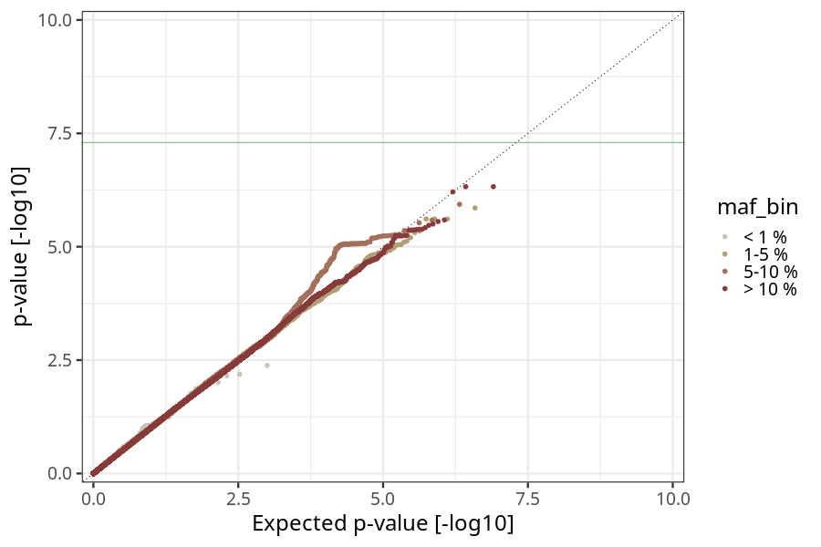
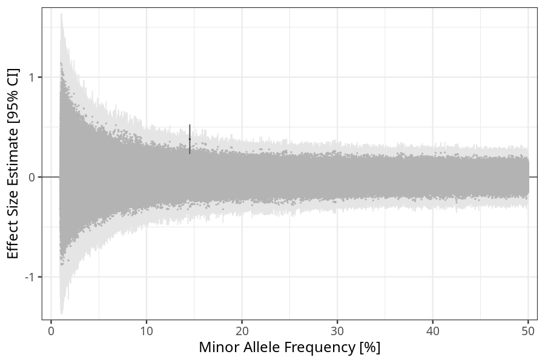
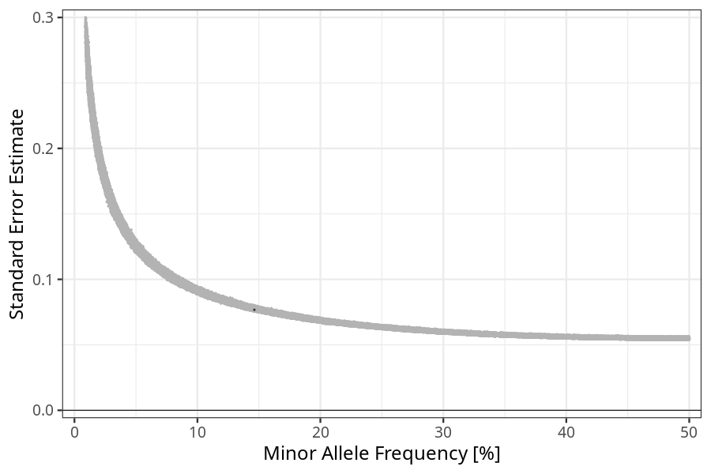

## hyperemesis_gravidarum in children_no_nausea_vomiting
Association results by regenie for hyperemesis_gravidarum in children_no_nausea_vomiting, followed by COJO analysis of the hits passing p < 5e-8.
### Manhattan

### Top hits
| SNP | chr | bp | ref | ref freq | beta | se | p | n | Ensembl | Phenoscanner | freq geno | b joint | b joint se | p joint | ld r |
| --- | --- | -- | --- | -------- | ---- | -- | - | - | ------- | ------------ | --------- | ------- | ---------- | ------- | ---- |
| rs34741019 | 1 | 209755528 | G | 0.145316 | 0.379026 | 0.0752548 | 4.7395e-07 | 55540.9 | [CAMK1G](ensembl/rs34741019.md) | No Results | 0.145379 | 0.379026 | 0.0752713 | 4.76691e-07 | 0 |
### Quality Control
- QQ plot

- Beta vs. Allele Frequency

- Standard error vs. Allele Frequency

