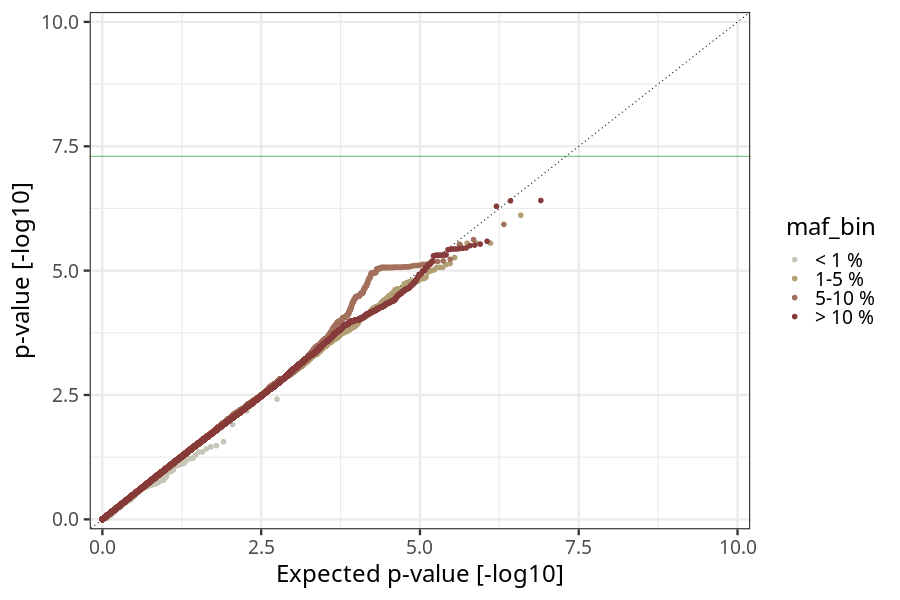
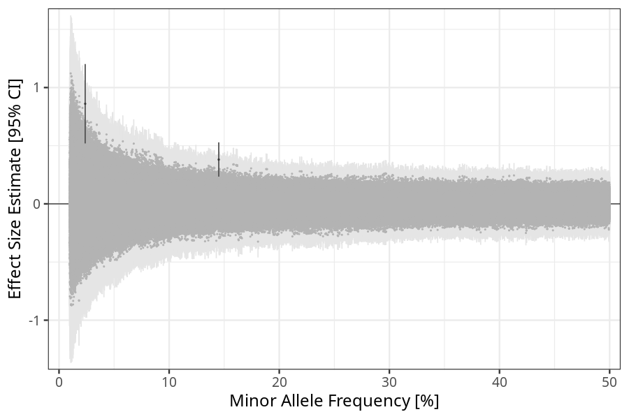
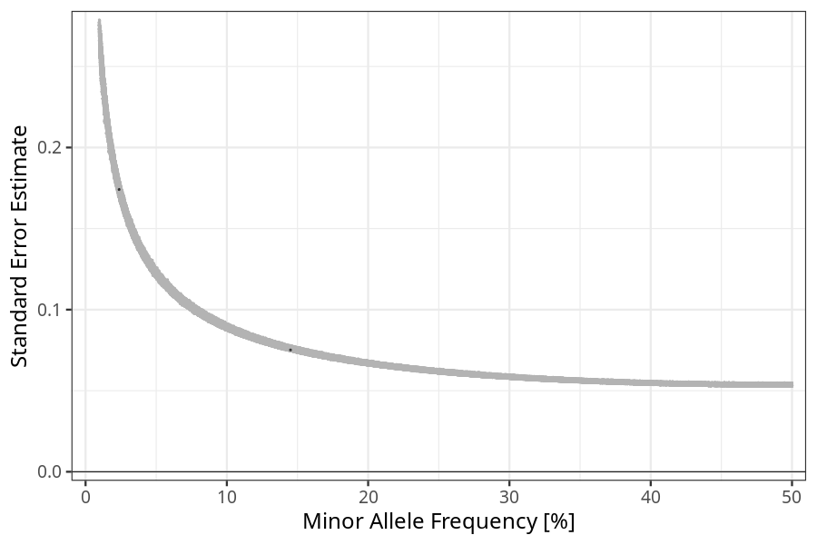

## hyperemesis_gravidarum in children
Association results by regenie for hyperemesis_gravidarum in children, followed by COJO analysis of the hits passing p < 5e-8.
### Manhattan

### Top hits
| SNP | chr | bp | ref | ref freq | beta | se | p | n | Ensembl | Phenoscanner | freq geno | b joint | b joint se | p joint | ld r |
| --- | --- | -- | --- | -------- | ---- | -- | - | - | ------- | ------------ | --------- | ------- | ---------- | ------- | ---- |
| rs35458333 | 1 | 209755967 | A | 0.145054 | 0.381211 | 0.0751291 | 3.89377e-07 | 74287.8 | [CAMK1G](ensembl/rs35458333.md) | No Results | 0.145395 | 0.381211 | 0.0751416 | 3.91111e-07 | 0 |
| rs78179953 | 2 | 239486309 | G | 0.023763 | 0.860619 | 0.174119 | 7.70457e-07 | 73944.5 | [LINC01107](ensembl/rs78179953.md) | No Results | 0.0251053 | 0.860619 | 0.174147 | 7.73558e-07 | 0 |
### Quality Control
- QQ plot

- Beta vs. Allele Frequency

- Standard error vs. Allele Frequency

