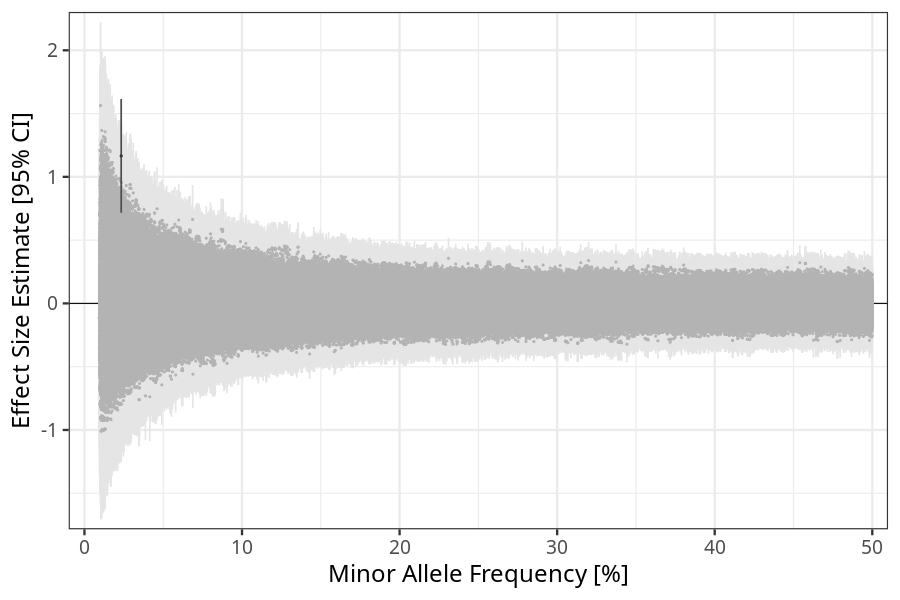
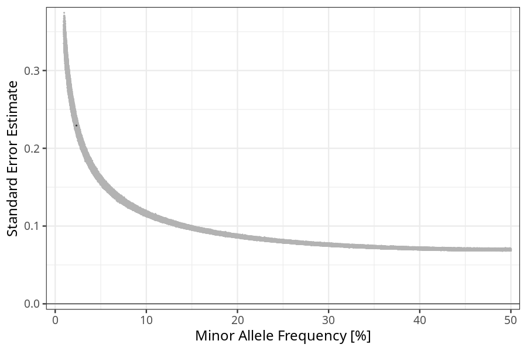

## hyperemesis_gravidarum in fathers
Association results by regenie for hyperemesis_gravidarum in fathers, followed by COJO analysis of the hits passing p < 5e-8.
### Manhattan

### Top hits
| SNP | chr | bp | ref | ref freq | beta | se | p | n | Ensembl | Phenoscanner | freq geno | b joint | b joint se | p joint | ld r |
| --- | --- | -- | --- | -------- | ---- | -- | - | - | ------- | ------------ | --------- | ------- | ---------- | ------- | ---- |
| rs78179953 | 2 | 239486309 | G | 0.0233226 | 1.1656 | 0.229249 | 3.68736e-07 | 38505.4 | [LINC01107](ensembl/rs78179953.md) | No Results | 0.0236336 | 1.1656 | 0.229323 | 3.71935e-07 | 0 |
### Quality Control
- QQ plot

- Beta vs. Allele Frequency

- Standard error vs. Allele Frequency

