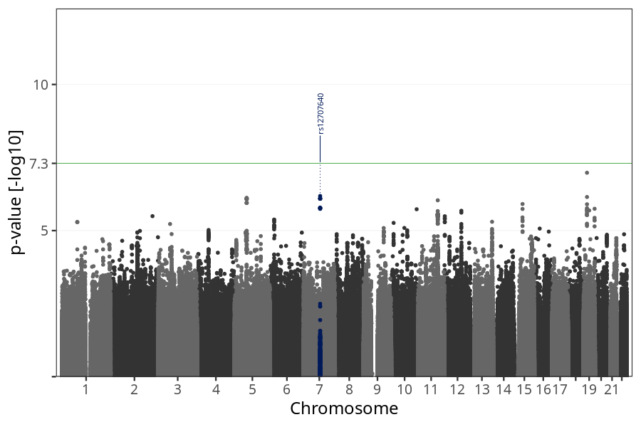
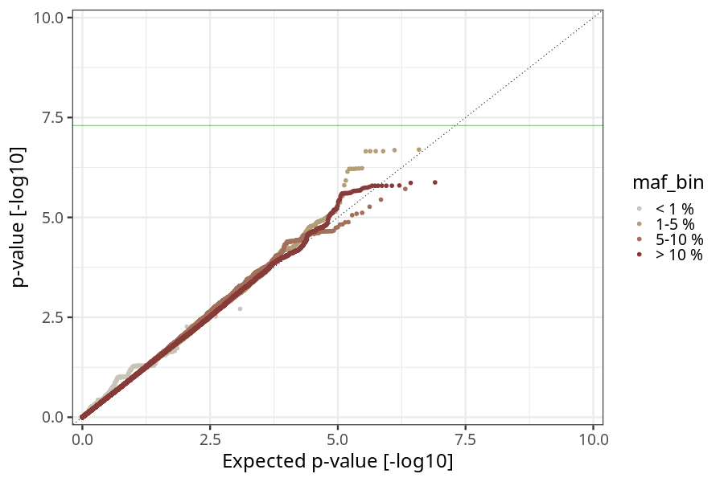
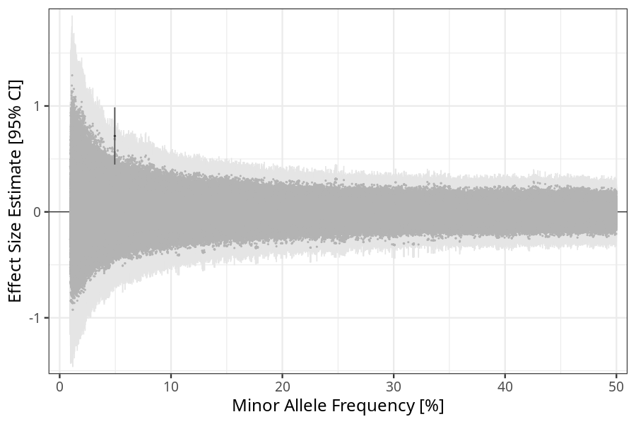
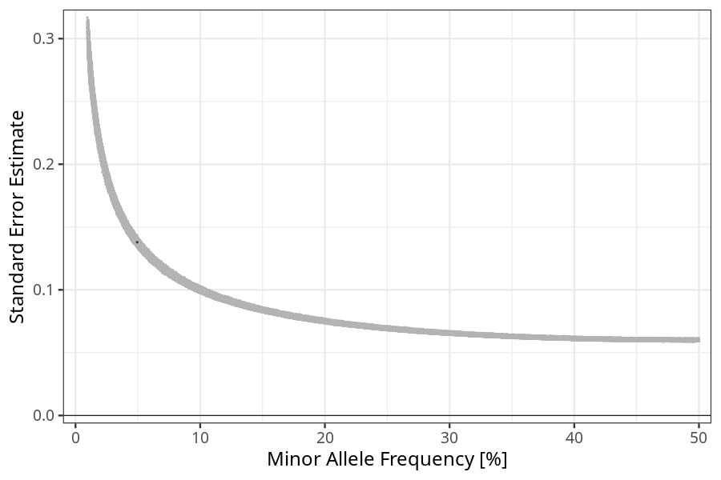

## hyperemesis_gravidarum in mothers_no_nausea_vomiting
Association results by regenie for hyperemesis_gravidarum in mothers_no_nausea_vomiting, followed by COJO analysis of the hits passing p < 5e-8.
### Manhattan

### Top hits
| SNP | chr | bp | ref | ref freq | beta | se | p | n | Ensembl | Phenoscanner | freq geno | b joint | b joint se | p joint | ld r |
| --- | --- | -- | --- | -------- | ---- | -- | - | - | ------- | ------------ | --------- | ------- | ---------- | ------- | ---- |
| rs12707640 | 7 | 83916042 | G | 0.0494789 | 0.717094 | 0.137945 | 2.01006e-07 | 41657.8 | [SEMA3A](ensembl/rs12707640.md) | No Results | 0.0496024 | 0.717094 | 0.137988 | 2.02768e-07 | 0 |
### Quality Control
- QQ plot

- Beta vs. Allele Frequency

- Standard error vs. Allele Frequency

